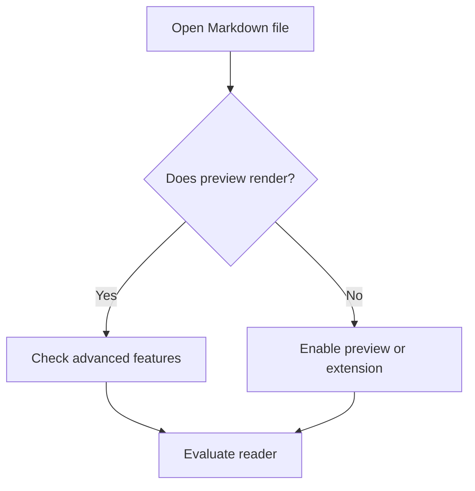
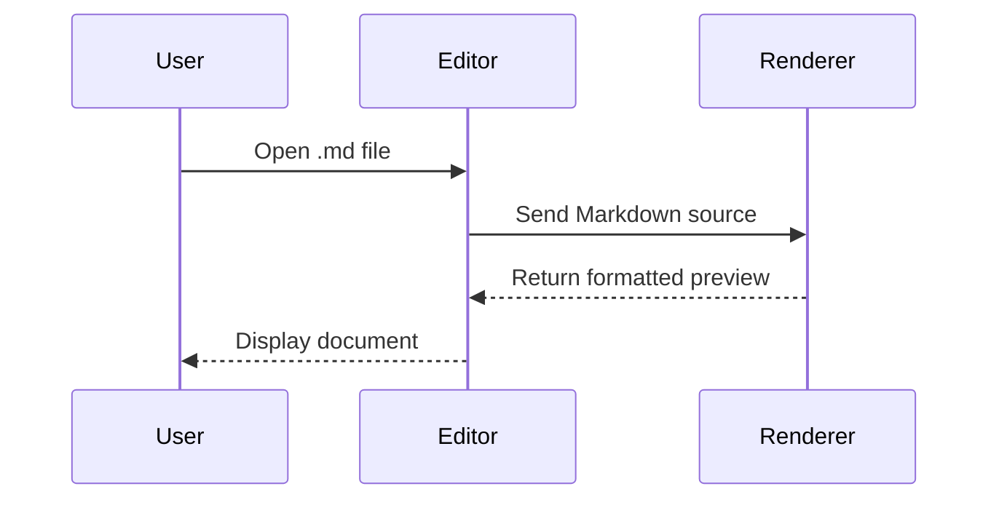
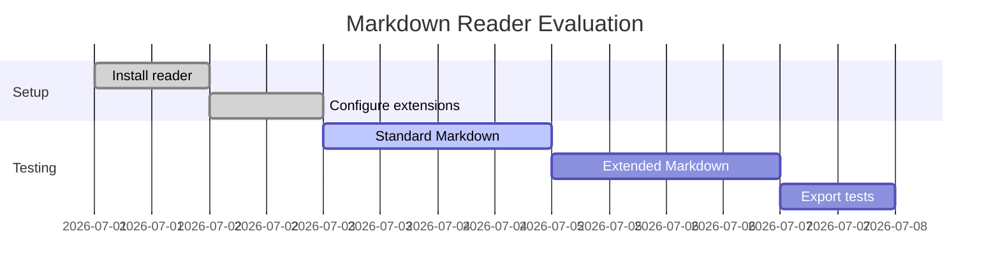

# Markdown Reader Stress Test

> A deliberately long Markdown document designed to test rendering, navigation, search, performance, typography, and support for common Markdown extensions.

**File purpose:** Use this document to compare Markdown readers and editors. It contains standard Markdown, GitHub Flavored Markdown, optional extensions, raw HTML, code blocks, tables, footnotes, Unicode, diagrams, and long-form text.

---

## Table of Contents

1. [Basic Typography](#1-basic-typography)
2. [Paragraphs and Line Breaks](#2-paragraphs-and-line-breaks)
3. [Lists](#3-lists)
4. [Links and Images](#4-links-and-images)
5. [Blockquotes](#5-blockquotes)
6. [Tables](#6-tables)
7. [Code](#7-code)
8. [Task Lists](#8-task-lists)
9. [Footnotes](#9-footnotes)
10. [Mathematics](#10-mathematics)
11. [Mermaid Diagrams](#11-mermaid-diagrams)
12. [Raw HTML](#12-raw-html)
13. [Unicode and International Text](#13-unicode-and-international-text)
14. [Escaping and Edge Cases](#14-escaping-and-edge-cases)
15. [Long-Form Reading Test](#15-long-form-reading-test)
16. [Repeated Technical Notes](#16-repeated-technical-notes)
17. [Large Reference Tables](#17-large-reference-tables)
18. [Final Reader Checklist](#18-final-reader-checklist)

---

# 1. Basic Typography

This is a normal paragraph. It includes **bold text**, *italic text*, ***bold italic text***, ~~strikethrough text~~, `inline code`, and an escaped \*asterisk\*.

You can also test combinations such as **bold with `inline code`**, *italic with [a link](https://example.com)*, and ~~strikethrough with **bold text**~~.

Inserted text uses Pandoc's and CriticMarkup's spelling: ++this was added++, and it nests like the others — ++inserted with **bold**++.

A lone `+` or a pair with a space between them is ordinary text: 1 + 1, and a++ b ++c stays as written.

## Heading Level 2

### Heading Level 3

#### Heading Level 4

##### Heading Level 5

###### Heading Level 6

A horizontal rule follows.

---

Another horizontal rule using a different syntax follows.

***

And another:

___

# 2. Paragraphs and Line Breaks

This paragraph is intentionally long enough to wrap across several lines in most readers. A good Markdown reader should preserve a comfortable line length, readable spacing, and consistent typography without making the text feel either cramped or excessively stretched. The visual distinction between headings, body text, links, inline code, and emphasis should remain clear even when a document contains many different formatting elements in close proximity.

This is a new paragraph created by a blank line.

This line ends with two spaces.  
This text should begin on a new rendered line without starting a new paragraph.

This line uses an HTML break.<br>
This text should also begin on a new line.

# 3. Lists

## Unordered List

- First item
- Second item
  - Nested item
  - Another nested item
    - Third-level item
- Third item

Alternative markers:

* Asterisk item
* Another item

+ Plus item
+ Another item

## Ordered List

1. First step
2. Second step
   1. Nested step
   2. Another nested step
3. Third step

Numbers may all be written as `1.` in the source:

1. Alpha
1. Bravo
1. Charlie
1. Delta

## Mixed List

1. Prepare the test environment.
   - Install the Markdown reader.
   - Open this file.
   - Enable preview mode, if available.
2. Check navigation.
   - Use the outline or table of contents.
   - Jump between distant headings.
3. Check editing behavior.
   - Modify a paragraph.
   - Add a table row.
   - Save and reopen the file.

## Definition List Extension

Markdown
: A lightweight markup language.

Reader
: Software that renders Markdown into formatted text.

Editor
: Software that allows the source Markdown to be changed.

# 4. Links and Images

An inline link: [Example website](https://example.com)

A link with a title: [Example website](https://example.com "Example Domain")

An automatic URL: <https://example.com>

An automatic email link: <someone@example.com>

A reference-style link: [OpenAI][openai-reference]

[openai-reference]: https://openai.com "OpenAI"

An internal link back to the [Table of Contents](#table-of-contents).

## Image Syntax

The following remote image may or may not load depending on network access and reader security settings:


A local-image reference is also included for syntax testing:

```markdown

```

An image with a title, which most readers show on hover:


A reference-style image, where the destination lives elsewhere in the document:

![Drag and drop][dnd-image]

[dnd-image]: ../pics/drag-and-drop.png "Dropping a file onto the editor"

## Wikilinks

Obsidian's spelling, rewritten before rendering:

- A heading in another document: [[markdown-syntax#3. Lists]]
- With an alias: [[markdown-syntax#3. Lists|see the lists chapter]]
- A heading in this document: [[#6. Tables]]
- An embed of a local image: `![[lightmode.png]]`

A wikilink with no heading is deliberately left as literal text, because `[[Notes]]` is also how citation numbering and reference links are written: [[Notes]].

## Block Ids

A paragraph can carry an id and be linked to from anywhere. ^stress-block

That paragraph ends with `^stress-block`, and [[#^stress-block]] points at it.

## Video and Audio

An image reference whose file is a video or a sound becomes a player. The files below do not exist in this repository — the point is that the *syntax* resolves to a player element rather than to a broken image:


Video extensions: `mp4`, `webm`, `ogg`, `mov`. Audio: `mp3`, `wav`, `aac`, `flac`, `m4a`.

## YouTube

A YouTube link alone in its paragraph becomes a thumbnail:

https://www.youtube.com/watch?v=dQw4w9WgXcQ

The image form does the same:


A YouTube link in the middle of a sentence — like https://youtu.be/dQw4w9WgXcQ here — stays an ordinary link, because replacing it would break the sentence around it.

# 5. Blockquotes

> This is a basic blockquote.
>
> It contains a second paragraph.

> **Note:** A reader should visually distinguish this content from normal body text.

Nested blockquotes:

> Level one
>
>> Level two
>>
>>> Level three

Blockquote containing a list:

> Recommended checks:
> - Typography
> - Spacing
> - Navigation
> - Search
> - Export

# 6. Tables

## Basic Table

| Feature | Expected Result | Priority |
|---|---|---:|
| Headings | Clear hierarchy | High |
| Tables | Aligned columns | High |
| Code blocks | Monospaced rendering | High |
| Footnotes | Clickable references | Medium |
| Mermaid | Diagram rendering | Optional |

## Alignment Table

| Left aligned | Center aligned | Right aligned |
|:---|:---:|---:|
| Alpha | Bravo | 100 |
| Charlie | Delta | 2,500 |
| Echo | Foxtrot | 98,765 |

## Wide Table

| ID | Product | Region | Status | Owner | Start Date | Target Date | Risk | Notes |
|---:|---|---|---|---|---|---|---|---|
| 001 | Atlas | APAC | In progress | A. Chen | 2026-01-12 | 2026-08-31 | Medium | Pilot deployment in three locations |
| 002 | Beacon | Europe | Planned | M. Rossi | 2026-09-01 | 2027-02-28 | Low | Requirements gathering underway |
| 003 | Cedar | Americas | Blocked | J. Smith | 2026-03-15 | 2026-10-15 | High | Awaiting third-party certification |
| 004 | Delta | Global | Complete | S. Kumar | 2025-06-01 | 2026-04-30 | Low | Final documentation published |

# 7. Code

Inline code looks like `print("Hello, Markdown")`.

## Python

```python
from dataclasses import dataclass
from typing import Iterable

@dataclass
class TestResult:
    name: str
    passed: bool
    details: str = ""

def summarize(results: Iterable[TestResult]) -> str:
    results = list(results)
    passed = sum(result.passed for result in results)
    total = len(results)
    return f"{passed}/{total} checks passed"

checks = [
    TestResult("Headings", True),
    TestResult("Tables", True),
    TestResult("Footnotes", False, "Extension not enabled"),
]

print(summarize(checks))
```

## JavaScript

```javascript
const features = [
  "headings",
  "tables",
  "code",
  "footnotes",
  "diagrams"
];

const supported = features.filter(feature => feature !== "diagrams");
console.log(`Supported: ${supported.join(", ")}`);
```

## JSON

```json
{
  "document": "markdown_reader_stress_test.md",
  "version": 1,
  "features": {
    "tables": true,
    "taskLists": true,
    "footnotes": "optional",
    "mermaid": "optional"
  }
}
```

## YAML

```yaml
application:
  name: markdown-reader-test
  mode: preview
  options:
    line_numbers: true
    wrap_text: true
    show_outline: true
```

## Bash

```bash
wc -l markdown_reader_stress_test.md
grep -n "^# " markdown_reader_stress_test.md
sed -n '1,80p' markdown_reader_stress_test.md
```

## PowerShell

```powershell
Get-Content .\markdown_reader_stress_test.md |
    Select-String -Pattern '^# ' |
    ForEach-Object { $_.Line }
```

## SQL

```sql
SELECT
    feature_name,
    supported,
    notes
FROM markdown_features
WHERE priority IN ('High', 'Medium')
ORDER BY priority, feature_name;
```

## Diff

```diff
- Old heading
+ Improved heading

- [ ] Incomplete task
+ [x] Completed task
```

# 8. Task Lists

- [x] Open the file
- [x] Check heading hierarchy
- [ ] Check table alignment
- [ ] Check syntax highlighting
- [ ] Check outline navigation
- [ ] Test export to HTML
- [ ] Test export to PDF

Nested task list:

- [ ] Reader evaluation
  - [x] Installation
  - [x] File association
  - [ ] Rendering
  - [ ] Editing
  - [ ] Export
  - [ ] Search

## Task List Shapes

Toggling a checkbox in the preview has to find the line to rewrite in the
source. Each shape below is a separate case for that lookup, and every one of
them is expected to toggle — and to toggle **only itself**.

Ordered, with a dot:

1. [ ] First ordered task
2. [x] Second ordered task
3. [ ] Third ordered task

Ordered, with a parenthesis:

1) [ ] Parenthesised marker
2) [x] Also a task

Other bullet characters:

* [ ] Asterisk marker
+ [x] Plus marker

Inside a quote:

> - [ ] A task in a blockquote
> - [x] A second one
> - [ ] A third

Deeply nested, mixing markers and depths:

- [ ] Level one
  - [x] Level two
    * [ ] Level three with an asterisk
      1. [ ] Level four, ordered
    * [x] Back to level three
  - [ ] Level two again

## Task Lists With No Blank Line Above Them

A list that begins immediately after prose is a different case for anything
that counts lines, because there is no blank line for a pattern to run past.
The next line is prose, and the list starts on the line after it with nothing
between them:
- [ ] Straight after the paragraph
- [x] Second in the run
- [ ] Third in the run

The same again, this time with a blank line above the list, which is how most
people write one:

- [ ] After a blank line
- [x] Second in the run
- [ ] Third in the run

## Adjacent Tasks

Nothing between these, so an off-by-one lands on a real task rather than on
nothing — which is the difference between a checkbox that looks dead and one
that silently ticks its neighbour. Toggle any single line and check that the
other five are untouched:

- [ ] Adjacent one
- [ ] Adjacent two
- [ ] Adjacent three
- [ ] Adjacent four
- [ ] Adjacent five
- [ ] Adjacent six

## A Task Carrying Continuation Lines

The shape from the file attached to #148. A task whose text is one line, followed
by a dozen indented lines that all belong to the same list item — mixed 4- and
8-space indents, every line an inline code span, and most ending in two trailing
spaces, which makes each one a hard break rather than a new paragraph. The whole
run is a single lazy-continuation paragraph inside the item.

Note also that the list starts immediately after the heading, with no blank line
between them.

### Essential
- [x] Repo management  
    `sudo nano /etc/dnf/dnf.conf`  
        `fastestmirror=True`  
        `max_parallel_downloads=10`  
        `defaultyes=True`  
    `sudo dnf install https://mirrors.example.org/free/release-$(rpm -E %dist).noarch.rpm -y`  
    `sudo dnf -y update`  
        `sudo dnf repolist --all | grep -i example`  
        `sudo dnf config-manager setopt example-free.enabled=1`  
    `flatpak remote-add --if-not-exists flathub https://dl.flathub.org/repo/flathub.flatpakrepo`  
- [x] Custom refresh rate  
    `kscreen-doctor output.1.addCustomMode.1920.1080.75000.reduced`

Two things this exercises that nothing else here does: a checkbox whose item is
many lines tall, so the control and its text can be laid out apart from one
another; and continuation lines holding `$(…)`, `|` and `%`, which several of
the preprocessing passes look for.

The one dimension this file cannot carry is line endings — it is LF throughout,
and the original was CRLF. That half is covered by
`scripts/taskToggleLineEndings.test.ts`, which drives both endings through the
real write-back.

## Task-Like Text That Is Not A Task

None of these should become a checkbox:

Some prose containing - [ ] in the middle of a sentence.

    - [ ] An indented code block, not a list

`- [ ] inline code`

```markdown
- [ ] A fenced code block
```

- Not a task, just a bullet whose text starts with a bracket \[x\]

# 9. Footnotes

This sentence contains a footnote reference.[^first]

A second reference can contain a longer explanation.[^long-note]

A named footnote can be reused.[^shared] Here it appears again.[^shared]

[^first]: This is the first footnote.

[^long-note]: This footnote contains multiple sentences. It is useful for testing spacing, backlink behavior, and the layout of longer notes. Some readers place footnotes at the end of the document, while others render them as popovers.

[^shared]: This footnote is referenced more than once.

# 10. Mathematics

Inline math extension:

$E = mc^2$

Block math extension:

$$
F = ma
$$

A longer expression:

$$
x = \frac{-b \pm \sqrt{b^2 - 4ac}}{2a}
$$

Matrix syntax:

$$
A =
\begin{bmatrix}
1 & 2 & 3 \\
4 & 5 & 6 \\
7 & 8 & 9
\end{bmatrix}
$$

# 11. Mermaid Diagrams

Some readers render Mermaid diagrams; others show the source code.

## Flowchart



## Sequence Diagram



## Gantt Chart



# 12. Raw HTML

<details>
<summary>Click to expand this section</summary>

This text is inside an HTML `<details>` element.

- It contains Markdown-like text.
- Support varies by renderer.
- Some readers sanitize raw HTML.

</details>

<kbd>Ctrl</kbd> + <kbd>Shift</kbd> + <kbd>V</kbd>

<mark>Highlighted text using the HTML mark element.</mark>

<sup>Superscript</sup> and <sub>subscript</sub>

<abbr title="Markdown">MD</abbr>

# 13. Unicode and International Text

## Symbols

✓ ✔ ✗ ✘ ★ ☆ → ← ↑ ↓ ↔ ⇒ ⇔ ∑ ∏ √ ∞ ≈ ≠ ≤ ≥ ± ÷ × ° µ Ω

## Currency

$ € £ ¥ ₹ ₩ ₽ ₺ ₫ ฿ ₱ SGD USD EUR GBP CNY JPY

## Accented Latin Text

Café, résumé, naïve, façade, coöperate, São Paulo, München, Łódź.

## Chinese

这是一个用于测试 Markdown 阅读器中文字体、行高和换行效果的段落。

## Japanese

これは Markdown リーダーの日本語表示を確認するためのテキストです。

## Korean

이 문장은 Markdown 리더의 한국어 표시를 테스트합니다.

## Arabic

هذا نص عربي لاختبار اتجاه الكتابة وعرض الأحرف.

## Hebrew

זהו טקסט בעברית לבדיקת כיוון הכתיבה.

## Emoji

😀 😎 🚀 🧪 📘 🛠️ ✅ ⚠️ ❌ 📊 🔍 🧭 🧩

# 14. Escaping and Edge Cases

Escaped characters:

\* not italic  
\_ not emphasis  
\# not a heading  
\[ not a link  
\` not code  
\\ backslash  

Characters inside inline code should remain literal: `* _ # [ ] ( ) < > &`.

A URL with query parameters:

<https://example.com/search?q=markdown&sort=recent>

A very_long_identifier_that_should_test_horizontal_scrolling_or_word_wrapping_behavior_in_the_reader_without_any_spaces_between_words_0123456789_ABCDEFGHIJKLMNOPQRSTUVWXYZ

A line with many punctuation marks:

`! " # $ % & ' ( ) * + , - . / : ; < = > ? @ [ \ ] ^ _ ` { | } ~`

# 15. Long-Form Reading Test

## Why Reader Design Matters

A Markdown reader appears simple because the source format is simple, but the reading experience depends on many small decisions. Typography, line length, spacing, contrast, heading hierarchy, code presentation, and navigation all influence how quickly a reader can understand a document. A technically correct renderer may still feel unpleasant if paragraphs stretch across an entire widescreen monitor, if code blocks have insufficient contrast, or if tables require excessive horizontal scrolling.

Good readers usually provide several layers of interaction. At the most basic level, they convert plain Markdown into formatted text. More capable applications add an outline, tabs, search, source and preview synchronization, theme controls, export functions, and support for extensions. The best option depends on whether the user primarily reads documentation, takes short notes, writes technical material, or maintains a large personal knowledge base.

## Source View Versus Preview View

Source view is valuable because Markdown remains readable even without rendering. Symbols such as hashes, asterisks, backticks, and hyphens communicate structure directly in the text. Preview view is useful because it removes syntax noise and presents the document as a polished page. Editors that offer a split view can provide both benefits at once, particularly when working with tables, code blocks, and links.

A synchronized split view should keep the source and preview aligned while scrolling. This sounds minor, but it becomes important in long documents. Without synchronization, users may repeatedly lose their position when switching between editing and reading. Outline navigation can solve part of the problem by showing headings in a sidebar and allowing direct jumps to major sections.

## Performance Considerations

Large Markdown files can reveal weaknesses that are invisible in short notes. Some editors re-render the entire document after every keystroke, which may create lag when the file contains hundreds of headings, tables, or diagrams. Others process only the changed section and remain responsive. Search speed, outline generation, and startup time also become more noticeable as the file grows.

Syntax highlighting adds another layer of work. A document containing dozens of fenced code blocks in different languages may require multiple parsers. Mermaid diagrams, mathematical notation, and embedded HTML can increase processing demands further. A reader that handles this test file smoothly is likely to perform well for ordinary documentation and note-taking.

## Portability

One of Markdown's strongest advantages is portability. A `.md` file is plain text and can be opened in almost any editor. The basic syntax is broadly compatible, but extensions are not universal. Tables and task lists are common, while footnotes, definition lists, mathematical expressions, admonitions, and Mermaid diagrams depend on the renderer.

For long-term notes, standard Markdown is the safest foundation. Extensions can still be useful, but it is worth checking how the source looks when an extension is unavailable. A Mermaid diagram, for example, remains visible as a code block even if it is not rendered. This graceful fallback is one reason Markdown works well across different tools.

# 16. Repeated Technical Notes

The sections below deliberately repeat a structured note format many times. This makes the file long enough to test outline navigation, scrolling performance, search, folding, and rendering consistency.

## Note 01: Document Structure

**Status:** In review  
**Owner:** Team 2  
**Priority:** Medium

Use headings consistently so readers can generate a reliable outline. Avoid skipping heading levels unless there is a clear structural reason. This numbered section is intentionally similar to the other sections, but the identifiers, status values, and examples vary. Repetition helps reveal whether a reader's outline remains usable when many headings have nearly identical names.

### Objectives

- Confirm that heading anchors remain unique.
- Check whether the outline shows the full heading text.
- Search for `Note 01` and verify that the correct section is selected.
- Collapse and expand this section, if folding is supported.

### Example Record

| Field | Value |
|---|---|
| Record ID | MD-1001 |
| Revision | 2.1 |
| Category | Document Structure |
| Confidence | 71% |
| Review Cycle | 2 months |

### Observation

The rendering should remain consistent across the entire file. Heading size, paragraph spacing, table borders, inline-code styling, and list indentation should not drift between early and late sections. Long documents are especially useful for identifying memory leaks, delayed scrolling, or outline synchronization problems.

> Test quote 01: A predictable interface reduces the effort required to understand complex information.

```text
section_id = 01
record_id  = MD-1001
state      = active
checksum   = 00007919
```


## Note 02: Naming Conventions

**Status:** Draft  
**Owner:** Team 3  
**Priority:** Low

Choose file names that remain understandable outside the original folder. Prefer descriptive words, stable dates, and version identifiers. This numbered section is intentionally similar to the other sections, but the identifiers, status values, and examples vary. Repetition helps reveal whether a reader's outline remains usable when many headings have nearly identical names.

### Objectives

- Confirm that heading anchors remain unique.
- Check whether the outline shows the full heading text.
- Search for `Note 02` and verify that the correct section is selected.
- Collapse and expand this section, if folding is supported.

### Example Record

| Field | Value |
|---|---|
| Record ID | MD-1002 |
| Revision | 3.2 |
| Category | Naming Conventions |
| Confidence | 72% |
| Review Cycle | 3 months |

### Observation

The rendering should remain consistent across the entire file. Heading size, paragraph spacing, table borders, inline-code styling, and list indentation should not drift between early and late sections. Long documents are especially useful for identifying memory leaks, delayed scrolling, or outline synchronization problems.

> Test quote 02: A predictable interface reduces the effort required to understand complex information.

```text
section_id = 02
record_id  = MD-1002
state      = active
checksum   = 00015838
```


## Note 03: Change Control

**Status:** Planned  
**Owner:** Team 4  
**Priority:** High

Record significant changes in a concise changelog. Include the date, author, reason, and expected effect of each revision. This numbered section is intentionally similar to the other sections, but the identifiers, status values, and examples vary. Repetition helps reveal whether a reader's outline remains usable when many headings have nearly identical names.

### Objectives

- Confirm that heading anchors remain unique.
- Check whether the outline shows the full heading text.
- Search for `Note 03` and verify that the correct section is selected.
- Collapse and expand this section, if folding is supported.

### Example Record

| Field | Value |
|---|---|
| Record ID | MD-1003 |
| Revision | 4.3 |
| Category | Change Control |
| Confidence | 73% |
| Review Cycle | 4 months |

### Observation

The rendering should remain consistent across the entire file. Heading size, paragraph spacing, table borders, inline-code styling, and list indentation should not drift between early and late sections. Long documents are especially useful for identifying memory leaks, delayed scrolling, or outline synchronization problems.

> Test quote 03: A predictable interface reduces the effort required to understand complex information.

```text
section_id = 03
record_id  = MD-1003
state      = active
checksum   = 00023757
```


## Note 04: Review Process

**Status:** Complete  
**Owner:** Team 5  
**Priority:** Medium

Separate factual verification from stylistic editing. A document can be clear but incorrect, or correct but difficult to use. This numbered section is intentionally similar to the other sections, but the identifiers, status values, and examples vary. Repetition helps reveal whether a reader's outline remains usable when many headings have nearly identical names.

### Objectives

- Confirm that heading anchors remain unique.
- Check whether the outline shows the full heading text.
- Search for `Note 04` and verify that the correct section is selected.
- Collapse and expand this section, if folding is supported.

### Example Record

| Field | Value |
|---|---|
| Record ID | MD-1004 |
| Revision | 5.4 |
| Category | Review Process |
| Confidence | 74% |
| Review Cycle | 5 months |

### Observation

The rendering should remain consistent across the entire file. Heading size, paragraph spacing, table borders, inline-code styling, and list indentation should not drift between early and late sections. Long documents are especially useful for identifying memory leaks, delayed scrolling, or outline synchronization problems.

> Test quote 04: A predictable interface reduces the effort required to understand complex information.

```text
section_id = 04
record_id  = MD-1004
state      = complete
checksum   = 00031676
```


## Note 05: Searchability

**Status:** In review  
**Owner:** Team 6  
**Priority:** Low

Use stable terminology for important concepts. Synonyms are natural, but inconsistent naming can make exact search less effective. This numbered section is intentionally similar to the other sections, but the identifiers, status values, and examples vary. Repetition helps reveal whether a reader's outline remains usable when many headings have nearly identical names.

### Objectives

- Confirm that heading anchors remain unique.
- Check whether the outline shows the full heading text.
- Search for `Note 05` and verify that the correct section is selected.
- Collapse and expand this section, if folding is supported.

### Example Record

| Field | Value |
|---|---|
| Record ID | MD-1005 |
| Revision | 1.5 |
| Category | Searchability |
| Confidence | 75% |
| Review Cycle | 6 months |

### Observation

The rendering should remain consistent across the entire file. Heading size, paragraph spacing, table borders, inline-code styling, and list indentation should not drift between early and late sections. Long documents are especially useful for identifying memory leaks, delayed scrolling, or outline synchronization problems.

> Test quote 05: A predictable interface reduces the effort required to understand complex information.

```text
section_id = 05
record_id  = MD-1005
state      = active
checksum   = 00039595
```


## Note 06: Cross-References

**Status:** Draft  
**Owner:** Team 7  
**Priority:** High

Link related sections directly. Internal links reduce duplication and help readers move between procedures, explanations, and reference material. This numbered section is intentionally similar to the other sections, but the identifiers, status values, and examples vary. Repetition helps reveal whether a reader's outline remains usable when many headings have nearly identical names.

### Objectives

- Confirm that heading anchors remain unique.
- Check whether the outline shows the full heading text.
- Search for `Note 06` and verify that the correct section is selected.
- Collapse and expand this section, if folding is supported.

### Example Record

| Field | Value |
|---|---|
| Record ID | MD-1006 |
| Revision | 2.6 |
| Category | Cross-References |
| Confidence | 76% |
| Review Cycle | 1 months |

### Observation

The rendering should remain consistent across the entire file. Heading size, paragraph spacing, table borders, inline-code styling, and list indentation should not drift between early and late sections. Long documents are especially useful for identifying memory leaks, delayed scrolling, or outline synchronization problems.

> Test quote 06: A predictable interface reduces the effort required to understand complex information.

```text
section_id = 06
record_id  = MD-1006
state      = active
checksum   = 00047514
```


## Note 07: Tables

**Status:** Planned  
**Owner:** Team 1  
**Priority:** Medium

Use tables for comparison and compact reference data. Avoid forcing long paragraphs into cells because narrow columns become difficult to read. This numbered section is intentionally similar to the other sections, but the identifiers, status values, and examples vary. Repetition helps reveal whether a reader's outline remains usable when many headings have nearly identical names.

### Objectives

- Confirm that heading anchors remain unique.
- Check whether the outline shows the full heading text.
- Search for `Note 07` and verify that the correct section is selected.
- Collapse and expand this section, if folding is supported.

### Example Record

| Field | Value |
|---|---|
| Record ID | MD-1007 |
| Revision | 3.7 |
| Category | Tables |
| Confidence | 77% |
| Review Cycle | 2 months |

### Observation

The rendering should remain consistent across the entire file. Heading size, paragraph spacing, table borders, inline-code styling, and list indentation should not drift between early and late sections. Long documents are especially useful for identifying memory leaks, delayed scrolling, or outline synchronization problems.

> Test quote 07: A predictable interface reduces the effort required to understand complex information.

```text
section_id = 07
record_id  = MD-1007
state      = active
checksum   = 00055433
```


## Note 08: Code Samples

**Status:** Complete  
**Owner:** Team 2  
**Priority:** Low

Keep examples complete enough to run with minimal modification. State assumptions and expected output near the relevant code block. This numbered section is intentionally similar to the other sections, but the identifiers, status values, and examples vary. Repetition helps reveal whether a reader's outline remains usable when many headings have nearly identical names.

### Objectives

- Confirm that heading anchors remain unique.
- Check whether the outline shows the full heading text.
- Search for `Note 08` and verify that the correct section is selected.
- Collapse and expand this section, if folding is supported.

### Example Record

| Field | Value |
|---|---|
| Record ID | MD-1008 |
| Revision | 4.8 |
| Category | Code Samples |
| Confidence | 78% |
| Review Cycle | 3 months |

### Observation

The rendering should remain consistent across the entire file. Heading size, paragraph spacing, table borders, inline-code styling, and list indentation should not drift between early and late sections. Long documents are especially useful for identifying memory leaks, delayed scrolling, or outline synchronization problems.

> Test quote 08: A predictable interface reduces the effort required to understand complex information.

```text
section_id = 08
record_id  = MD-1008
state      = complete
checksum   = 00063352
```


## Note 09: Warnings

**Status:** In review  
**Owner:** Team 3  
**Priority:** High

Make hazards and irreversible actions prominent. A warning should describe the risk, the trigger, and the safe alternative. This numbered section is intentionally similar to the other sections, but the identifiers, status values, and examples vary. Repetition helps reveal whether a reader's outline remains usable when many headings have nearly identical names.

### Objectives

- Confirm that heading anchors remain unique.
- Check whether the outline shows the full heading text.
- Search for `Note 09` and verify that the correct section is selected.
- Collapse and expand this section, if folding is supported.

### Example Record

| Field | Value |
|---|---|
| Record ID | MD-1009 |
| Revision | 5.9 |
| Category | Warnings |
| Confidence | 79% |
| Review Cycle | 4 months |

### Observation

The rendering should remain consistent across the entire file. Heading size, paragraph spacing, table borders, inline-code styling, and list indentation should not drift between early and late sections. Long documents are especially useful for identifying memory leaks, delayed scrolling, or outline synchronization problems.

> Test quote 09: A predictable interface reduces the effort required to understand complex information.

```text
section_id = 09
record_id  = MD-1009
state      = active
checksum   = 00071271
```


## Note 10: Examples

**Status:** Draft  
**Owner:** Team 4  
**Priority:** Medium

Concrete examples expose ambiguity. Include both typical cases and at least one edge case when documenting a rule. This numbered section is intentionally similar to the other sections, but the identifiers, status values, and examples vary. Repetition helps reveal whether a reader's outline remains usable when many headings have nearly identical names.

### Objectives

- Confirm that heading anchors remain unique.
- Check whether the outline shows the full heading text.
- Search for `Note 10` and verify that the correct section is selected.
- Collapse and expand this section, if folding is supported.

### Example Record

| Field | Value |
|---|---|
| Record ID | MD-1010 |
| Revision | 1.0 |
| Category | Examples |
| Confidence | 80% |
| Review Cycle | 5 months |

### Observation

The rendering should remain consistent across the entire file. Heading size, paragraph spacing, table borders, inline-code styling, and list indentation should not drift between early and late sections. Long documents are especially useful for identifying memory leaks, delayed scrolling, or outline synchronization problems.

> Test quote 10: A predictable interface reduces the effort required to understand complex information.

```text
section_id = 10
record_id  = MD-1010
state      = active
checksum   = 00079190
```


## Note 11: Versioning

**Status:** Planned  
**Owner:** Team 5  
**Priority:** Low

Use versions that communicate whether a change is breaking, additive, or corrective. The exact scheme matters less than consistency. This numbered section is intentionally similar to the other sections, but the identifiers, status values, and examples vary. Repetition helps reveal whether a reader's outline remains usable when many headings have nearly identical names.

### Objectives

- Confirm that heading anchors remain unique.
- Check whether the outline shows the full heading text.
- Search for `Note 11` and verify that the correct section is selected.
- Collapse and expand this section, if folding is supported.

### Example Record

| Field | Value |
|---|---|
| Record ID | MD-1011 |
| Revision | 2.1 |
| Category | Versioning |
| Confidence | 81% |
| Review Cycle | 6 months |

### Observation

The rendering should remain consistent across the entire file. Heading size, paragraph spacing, table borders, inline-code styling, and list indentation should not drift between early and late sections. Long documents are especially useful for identifying memory leaks, delayed scrolling, or outline synchronization problems.

> Test quote 11: A predictable interface reduces the effort required to understand complex information.

```text
section_id = 11
record_id  = MD-1011
state      = active
checksum   = 00087109
```


## Note 12: Accessibility

**Status:** Complete  
**Owner:** Team 6  
**Priority:** High

Ensure sufficient contrast, meaningful link text, logical heading order, and readable alternatives for visual content. This numbered section is intentionally similar to the other sections, but the identifiers, status values, and examples vary. Repetition helps reveal whether a reader's outline remains usable when many headings have nearly identical names.

### Objectives

- Confirm that heading anchors remain unique.
- Check whether the outline shows the full heading text.
- Search for `Note 12` and verify that the correct section is selected.
- Collapse and expand this section, if folding is supported.

### Example Record

| Field | Value |
|---|---|
| Record ID | MD-1012 |
| Revision | 3.2 |
| Category | Accessibility |
| Confidence | 82% |
| Review Cycle | 1 months |

### Observation

The rendering should remain consistent across the entire file. Heading size, paragraph spacing, table borders, inline-code styling, and list indentation should not drift between early and late sections. Long documents are especially useful for identifying memory leaks, delayed scrolling, or outline synchronization problems.

> Test quote 12: A predictable interface reduces the effort required to understand complex information.

```text
section_id = 12
record_id  = MD-1012
state      = complete
checksum   = 00095028
```


## Note 13: Document Structure

**Status:** In review  
**Owner:** Team 7  
**Priority:** Medium

Use headings consistently so readers can generate a reliable outline. Avoid skipping heading levels unless there is a clear structural reason. This numbered section is intentionally similar to the other sections, but the identifiers, status values, and examples vary. Repetition helps reveal whether a reader's outline remains usable when many headings have nearly identical names.

### Objectives

- Confirm that heading anchors remain unique.
- Check whether the outline shows the full heading text.
- Search for `Note 13` and verify that the correct section is selected.
- Collapse and expand this section, if folding is supported.

### Example Record

| Field | Value |
|---|---|
| Record ID | MD-1013 |
| Revision | 4.3 |
| Category | Document Structure |
| Confidence | 83% |
| Review Cycle | 2 months |

### Observation

The rendering should remain consistent across the entire file. Heading size, paragraph spacing, table borders, inline-code styling, and list indentation should not drift between early and late sections. Long documents are especially useful for identifying memory leaks, delayed scrolling, or outline synchronization problems.

> Test quote 13: A predictable interface reduces the effort required to understand complex information.

```text
section_id = 13
record_id  = MD-1013
state      = active
checksum   = 00102947
```


## Note 14: Naming Conventions

**Status:** Draft  
**Owner:** Team 1  
**Priority:** Low

Choose file names that remain understandable outside the original folder. Prefer descriptive words, stable dates, and version identifiers. This numbered section is intentionally similar to the other sections, but the identifiers, status values, and examples vary. Repetition helps reveal whether a reader's outline remains usable when many headings have nearly identical names.

### Objectives

- Confirm that heading anchors remain unique.
- Check whether the outline shows the full heading text.
- Search for `Note 14` and verify that the correct section is selected.
- Collapse and expand this section, if folding is supported.

### Example Record

| Field | Value |
|---|---|
| Record ID | MD-1014 |
| Revision | 5.4 |
| Category | Naming Conventions |
| Confidence | 84% |
| Review Cycle | 3 months |

### Observation

The rendering should remain consistent across the entire file. Heading size, paragraph spacing, table borders, inline-code styling, and list indentation should not drift between early and late sections. Long documents are especially useful for identifying memory leaks, delayed scrolling, or outline synchronization problems.

> Test quote 14: A predictable interface reduces the effort required to understand complex information.

```text
section_id = 14
record_id  = MD-1014
state      = active
checksum   = 00110866
```


## Note 15: Change Control

**Status:** Planned  
**Owner:** Team 2  
**Priority:** High

Record significant changes in a concise changelog. Include the date, author, reason, and expected effect of each revision. This numbered section is intentionally similar to the other sections, but the identifiers, status values, and examples vary. Repetition helps reveal whether a reader's outline remains usable when many headings have nearly identical names.

### Objectives

- Confirm that heading anchors remain unique.
- Check whether the outline shows the full heading text.
- Search for `Note 15` and verify that the correct section is selected.
- Collapse and expand this section, if folding is supported.

### Example Record

| Field | Value |
|---|---|
| Record ID | MD-1015 |
| Revision | 1.5 |
| Category | Change Control |
| Confidence | 85% |
| Review Cycle | 4 months |

### Observation

The rendering should remain consistent across the entire file. Heading size, paragraph spacing, table borders, inline-code styling, and list indentation should not drift between early and late sections. Long documents are especially useful for identifying memory leaks, delayed scrolling, or outline synchronization problems.

> Test quote 15: A predictable interface reduces the effort required to understand complex information.

```text
section_id = 15
record_id  = MD-1015
state      = active
checksum   = 00118785
```


## Note 16: Review Process

**Status:** Complete  
**Owner:** Team 3  
**Priority:** Medium

Separate factual verification from stylistic editing. A document can be clear but incorrect, or correct but difficult to use. This numbered section is intentionally similar to the other sections, but the identifiers, status values, and examples vary. Repetition helps reveal whether a reader's outline remains usable when many headings have nearly identical names.

### Objectives

- Confirm that heading anchors remain unique.
- Check whether the outline shows the full heading text.
- Search for `Note 16` and verify that the correct section is selected.
- Collapse and expand this section, if folding is supported.

### Example Record

| Field | Value |
|---|---|
| Record ID | MD-1016 |
| Revision | 2.6 |
| Category | Review Process |
| Confidence | 86% |
| Review Cycle | 5 months |

### Observation

The rendering should remain consistent across the entire file. Heading size, paragraph spacing, table borders, inline-code styling, and list indentation should not drift between early and late sections. Long documents are especially useful for identifying memory leaks, delayed scrolling, or outline synchronization problems.

> Test quote 16: A predictable interface reduces the effort required to understand complex information.

```text
section_id = 16
record_id  = MD-1016
state      = complete
checksum   = 00126704
```


## Note 17: Searchability

**Status:** In review  
**Owner:** Team 4  
**Priority:** Low

Use stable terminology for important concepts. Synonyms are natural, but inconsistent naming can make exact search less effective. This numbered section is intentionally similar to the other sections, but the identifiers, status values, and examples vary. Repetition helps reveal whether a reader's outline remains usable when many headings have nearly identical names.

### Objectives

- Confirm that heading anchors remain unique.
- Check whether the outline shows the full heading text.
- Search for `Note 17` and verify that the correct section is selected.
- Collapse and expand this section, if folding is supported.

### Example Record

| Field | Value |
|---|---|
| Record ID | MD-1017 |
| Revision | 3.7 |
| Category | Searchability |
| Confidence | 87% |
| Review Cycle | 6 months |

### Observation

The rendering should remain consistent across the entire file. Heading size, paragraph spacing, table borders, inline-code styling, and list indentation should not drift between early and late sections. Long documents are especially useful for identifying memory leaks, delayed scrolling, or outline synchronization problems.

> Test quote 17: A predictable interface reduces the effort required to understand complex information.

```text
section_id = 17
record_id  = MD-1017
state      = active
checksum   = 00134623
```


## Note 18: Cross-References

**Status:** Draft  
**Owner:** Team 5  
**Priority:** High

Link related sections directly. Internal links reduce duplication and help readers move between procedures, explanations, and reference material. This numbered section is intentionally similar to the other sections, but the identifiers, status values, and examples vary. Repetition helps reveal whether a reader's outline remains usable when many headings have nearly identical names.

### Objectives

- Confirm that heading anchors remain unique.
- Check whether the outline shows the full heading text.
- Search for `Note 18` and verify that the correct section is selected.
- Collapse and expand this section, if folding is supported.

### Example Record

| Field | Value |
|---|---|
| Record ID | MD-1018 |
| Revision | 4.8 |
| Category | Cross-References |
| Confidence | 88% |
| Review Cycle | 1 months |

### Observation

The rendering should remain consistent across the entire file. Heading size, paragraph spacing, table borders, inline-code styling, and list indentation should not drift between early and late sections. Long documents are especially useful for identifying memory leaks, delayed scrolling, or outline synchronization problems.

> Test quote 18: A predictable interface reduces the effort required to understand complex information.

```text
section_id = 18
record_id  = MD-1018
state      = active
checksum   = 00142542
```


## Note 19: Tables

**Status:** Planned  
**Owner:** Team 6  
**Priority:** Medium

Use tables for comparison and compact reference data. Avoid forcing long paragraphs into cells because narrow columns become difficult to read. This numbered section is intentionally similar to the other sections, but the identifiers, status values, and examples vary. Repetition helps reveal whether a reader's outline remains usable when many headings have nearly identical names.

### Objectives

- Confirm that heading anchors remain unique.
- Check whether the outline shows the full heading text.
- Search for `Note 19` and verify that the correct section is selected.
- Collapse and expand this section, if folding is supported.

### Example Record

| Field | Value |
|---|---|
| Record ID | MD-1019 |
| Revision | 5.9 |
| Category | Tables |
| Confidence | 89% |
| Review Cycle | 2 months |

### Observation

The rendering should remain consistent across the entire file. Heading size, paragraph spacing, table borders, inline-code styling, and list indentation should not drift between early and late sections. Long documents are especially useful for identifying memory leaks, delayed scrolling, or outline synchronization problems.

> Test quote 19: A predictable interface reduces the effort required to understand complex information.

```text
section_id = 19
record_id  = MD-1019
state      = active
checksum   = 00150461
```


## Note 20: Code Samples

**Status:** Complete  
**Owner:** Team 7  
**Priority:** Low

Keep examples complete enough to run with minimal modification. State assumptions and expected output near the relevant code block. This numbered section is intentionally similar to the other sections, but the identifiers, status values, and examples vary. Repetition helps reveal whether a reader's outline remains usable when many headings have nearly identical names.

### Objectives

- Confirm that heading anchors remain unique.
- Check whether the outline shows the full heading text.
- Search for `Note 20` and verify that the correct section is selected.
- Collapse and expand this section, if folding is supported.

### Example Record

| Field | Value |
|---|---|
| Record ID | MD-1020 |
| Revision | 1.0 |
| Category | Code Samples |
| Confidence | 90% |
| Review Cycle | 3 months |

### Observation

The rendering should remain consistent across the entire file. Heading size, paragraph spacing, table borders, inline-code styling, and list indentation should not drift between early and late sections. Long documents are especially useful for identifying memory leaks, delayed scrolling, or outline synchronization problems.

> Test quote 20: A predictable interface reduces the effort required to understand complex information.

```text
section_id = 20
record_id  = MD-1020
state      = complete
checksum   = 00158380
```


## Note 21: Warnings

**Status:** In review  
**Owner:** Team 1  
**Priority:** High

Make hazards and irreversible actions prominent. A warning should describe the risk, the trigger, and the safe alternative. This numbered section is intentionally similar to the other sections, but the identifiers, status values, and examples vary. Repetition helps reveal whether a reader's outline remains usable when many headings have nearly identical names.

### Objectives

- Confirm that heading anchors remain unique.
- Check whether the outline shows the full heading text.
- Search for `Note 21` and verify that the correct section is selected.
- Collapse and expand this section, if folding is supported.

### Example Record

| Field | Value |
|---|---|
| Record ID | MD-1021 |
| Revision | 2.1 |
| Category | Warnings |
| Confidence | 91% |
| Review Cycle | 4 months |

### Observation

The rendering should remain consistent across the entire file. Heading size, paragraph spacing, table borders, inline-code styling, and list indentation should not drift between early and late sections. Long documents are especially useful for identifying memory leaks, delayed scrolling, or outline synchronization problems.

> Test quote 21: A predictable interface reduces the effort required to understand complex information.

```text
section_id = 21
record_id  = MD-1021
state      = active
checksum   = 00166299
```


## Note 22: Examples

**Status:** Draft  
**Owner:** Team 2  
**Priority:** Medium

Concrete examples expose ambiguity. Include both typical cases and at least one edge case when documenting a rule. This numbered section is intentionally similar to the other sections, but the identifiers, status values, and examples vary. Repetition helps reveal whether a reader's outline remains usable when many headings have nearly identical names.

### Objectives

- Confirm that heading anchors remain unique.
- Check whether the outline shows the full heading text.
- Search for `Note 22` and verify that the correct section is selected.
- Collapse and expand this section, if folding is supported.

### Example Record

| Field | Value |
|---|---|
| Record ID | MD-1022 |
| Revision | 3.2 |
| Category | Examples |
| Confidence | 92% |
| Review Cycle | 5 months |

### Observation

The rendering should remain consistent across the entire file. Heading size, paragraph spacing, table borders, inline-code styling, and list indentation should not drift between early and late sections. Long documents are especially useful for identifying memory leaks, delayed scrolling, or outline synchronization problems.

> Test quote 22: A predictable interface reduces the effort required to understand complex information.

```text
section_id = 22
record_id  = MD-1022
state      = active
checksum   = 00174218
```


## Note 23: Versioning

**Status:** Planned  
**Owner:** Team 3  
**Priority:** Low

Use versions that communicate whether a change is breaking, additive, or corrective. The exact scheme matters less than consistency. This numbered section is intentionally similar to the other sections, but the identifiers, status values, and examples vary. Repetition helps reveal whether a reader's outline remains usable when many headings have nearly identical names.

### Objectives

- Confirm that heading anchors remain unique.
- Check whether the outline shows the full heading text.
- Search for `Note 23` and verify that the correct section is selected.
- Collapse and expand this section, if folding is supported.

### Example Record

| Field | Value |
|---|---|
| Record ID | MD-1023 |
| Revision | 4.3 |
| Category | Versioning |
| Confidence | 93% |
| Review Cycle | 6 months |

### Observation

The rendering should remain consistent across the entire file. Heading size, paragraph spacing, table borders, inline-code styling, and list indentation should not drift between early and late sections. Long documents are especially useful for identifying memory leaks, delayed scrolling, or outline synchronization problems.

> Test quote 23: A predictable interface reduces the effort required to understand complex information.

```text
section_id = 23
record_id  = MD-1023
state      = active
checksum   = 00182137
```


## Note 24: Accessibility

**Status:** Complete  
**Owner:** Team 4  
**Priority:** High

Ensure sufficient contrast, meaningful link text, logical heading order, and readable alternatives for visual content. This numbered section is intentionally similar to the other sections, but the identifiers, status values, and examples vary. Repetition helps reveal whether a reader's outline remains usable when many headings have nearly identical names.

### Objectives

- Confirm that heading anchors remain unique.
- Check whether the outline shows the full heading text.
- Search for `Note 24` and verify that the correct section is selected.
- Collapse and expand this section, if folding is supported.

### Example Record

| Field | Value |
|---|---|
| Record ID | MD-1024 |
| Revision | 5.4 |
| Category | Accessibility |
| Confidence | 94% |
| Review Cycle | 1 months |

### Observation

The rendering should remain consistent across the entire file. Heading size, paragraph spacing, table borders, inline-code styling, and list indentation should not drift between early and late sections. Long documents are especially useful for identifying memory leaks, delayed scrolling, or outline synchronization problems.

> Test quote 24: A predictable interface reduces the effort required to understand complex information.

```text
section_id = 24
record_id  = MD-1024
state      = complete
checksum   = 00190056
```


## Note 25: Document Structure

**Status:** In review  
**Owner:** Team 5  
**Priority:** Medium

Use headings consistently so readers can generate a reliable outline. Avoid skipping heading levels unless there is a clear structural reason. This numbered section is intentionally similar to the other sections, but the identifiers, status values, and examples vary. Repetition helps reveal whether a reader's outline remains usable when many headings have nearly identical names.

### Objectives

- Confirm that heading anchors remain unique.
- Check whether the outline shows the full heading text.
- Search for `Note 25` and verify that the correct section is selected.
- Collapse and expand this section, if folding is supported.

### Example Record

| Field | Value |
|---|---|
| Record ID | MD-1025 |
| Revision | 1.5 |
| Category | Document Structure |
| Confidence | 95% |
| Review Cycle | 2 months |

### Observation

The rendering should remain consistent across the entire file. Heading size, paragraph spacing, table borders, inline-code styling, and list indentation should not drift between early and late sections. Long documents are especially useful for identifying memory leaks, delayed scrolling, or outline synchronization problems.

> Test quote 25: A predictable interface reduces the effort required to understand complex information.

```text
section_id = 25
record_id  = MD-1025
state      = active
checksum   = 00197975
```


## Note 26: Naming Conventions

**Status:** Draft  
**Owner:** Team 6  
**Priority:** Low

Choose file names that remain understandable outside the original folder. Prefer descriptive words, stable dates, and version identifiers. This numbered section is intentionally similar to the other sections, but the identifiers, status values, and examples vary. Repetition helps reveal whether a reader's outline remains usable when many headings have nearly identical names.

### Objectives

- Confirm that heading anchors remain unique.
- Check whether the outline shows the full heading text.
- Search for `Note 26` and verify that the correct section is selected.
- Collapse and expand this section, if folding is supported.

### Example Record

| Field | Value |
|---|---|
| Record ID | MD-1026 |
| Revision | 2.6 |
| Category | Naming Conventions |
| Confidence | 96% |
| Review Cycle | 3 months |

### Observation

The rendering should remain consistent across the entire file. Heading size, paragraph spacing, table borders, inline-code styling, and list indentation should not drift between early and late sections. Long documents are especially useful for identifying memory leaks, delayed scrolling, or outline synchronization problems.

> Test quote 26: A predictable interface reduces the effort required to understand complex information.

```text
section_id = 26
record_id  = MD-1026
state      = active
checksum   = 00205894
```


## Note 27: Change Control

**Status:** Planned  
**Owner:** Team 7  
**Priority:** High

Record significant changes in a concise changelog. Include the date, author, reason, and expected effect of each revision. This numbered section is intentionally similar to the other sections, but the identifiers, status values, and examples vary. Repetition helps reveal whether a reader's outline remains usable when many headings have nearly identical names.

### Objectives

- Confirm that heading anchors remain unique.
- Check whether the outline shows the full heading text.
- Search for `Note 27` and verify that the correct section is selected.
- Collapse and expand this section, if folding is supported.

### Example Record

| Field | Value |
|---|---|
| Record ID | MD-1027 |
| Revision | 3.7 |
| Category | Change Control |
| Confidence | 97% |
| Review Cycle | 4 months |

### Observation

The rendering should remain consistent across the entire file. Heading size, paragraph spacing, table borders, inline-code styling, and list indentation should not drift between early and late sections. Long documents are especially useful for identifying memory leaks, delayed scrolling, or outline synchronization problems.

> Test quote 27: A predictable interface reduces the effort required to understand complex information.

```text
section_id = 27
record_id  = MD-1027
state      = active
checksum   = 00213813
```


## Note 28: Review Process

**Status:** Complete  
**Owner:** Team 1  
**Priority:** Medium

Separate factual verification from stylistic editing. A document can be clear but incorrect, or correct but difficult to use. This numbered section is intentionally similar to the other sections, but the identifiers, status values, and examples vary. Repetition helps reveal whether a reader's outline remains usable when many headings have nearly identical names.

### Objectives

- Confirm that heading anchors remain unique.
- Check whether the outline shows the full heading text.
- Search for `Note 28` and verify that the correct section is selected.
- Collapse and expand this section, if folding is supported.

### Example Record

| Field | Value |
|---|---|
| Record ID | MD-1028 |
| Revision | 4.8 |
| Category | Review Process |
| Confidence | 98% |
| Review Cycle | 5 months |

### Observation

The rendering should remain consistent across the entire file. Heading size, paragraph spacing, table borders, inline-code styling, and list indentation should not drift between early and late sections. Long documents are especially useful for identifying memory leaks, delayed scrolling, or outline synchronization problems.

> Test quote 28: A predictable interface reduces the effort required to understand complex information.

```text
section_id = 28
record_id  = MD-1028
state      = complete
checksum   = 00221732
```


## Note 29: Searchability

**Status:** In review  
**Owner:** Team 2  
**Priority:** Low

Use stable terminology for important concepts. Synonyms are natural, but inconsistent naming can make exact search less effective. This numbered section is intentionally similar to the other sections, but the identifiers, status values, and examples vary. Repetition helps reveal whether a reader's outline remains usable when many headings have nearly identical names.

### Objectives

- Confirm that heading anchors remain unique.
- Check whether the outline shows the full heading text.
- Search for `Note 29` and verify that the correct section is selected.
- Collapse and expand this section, if folding is supported.

### Example Record

| Field | Value |
|---|---|
| Record ID | MD-1029 |
| Revision | 5.9 |
| Category | Searchability |
| Confidence | 70% |
| Review Cycle | 6 months |

### Observation

The rendering should remain consistent across the entire file. Heading size, paragraph spacing, table borders, inline-code styling, and list indentation should not drift between early and late sections. Long documents are especially useful for identifying memory leaks, delayed scrolling, or outline synchronization problems.

> Test quote 29: A predictable interface reduces the effort required to understand complex information.

```text
section_id = 29
record_id  = MD-1029
state      = active
checksum   = 00229651
```


## Note 30: Cross-References

**Status:** Draft  
**Owner:** Team 3  
**Priority:** High

Link related sections directly. Internal links reduce duplication and help readers move between procedures, explanations, and reference material. This numbered section is intentionally similar to the other sections, but the identifiers, status values, and examples vary. Repetition helps reveal whether a reader's outline remains usable when many headings have nearly identical names.

### Objectives

- Confirm that heading anchors remain unique.
- Check whether the outline shows the full heading text.
- Search for `Note 30` and verify that the correct section is selected.
- Collapse and expand this section, if folding is supported.

### Example Record

| Field | Value |
|---|---|
| Record ID | MD-1030 |
| Revision | 1.0 |
| Category | Cross-References |
| Confidence | 71% |
| Review Cycle | 1 months |

### Observation

The rendering should remain consistent across the entire file. Heading size, paragraph spacing, table borders, inline-code styling, and list indentation should not drift between early and late sections. Long documents are especially useful for identifying memory leaks, delayed scrolling, or outline synchronization problems.

> Test quote 30: A predictable interface reduces the effort required to understand complex information.

```text
section_id = 30
record_id  = MD-1030
state      = active
checksum   = 00237570
```


## Note 31: Tables

**Status:** Planned  
**Owner:** Team 4  
**Priority:** Medium

Use tables for comparison and compact reference data. Avoid forcing long paragraphs into cells because narrow columns become difficult to read. This numbered section is intentionally similar to the other sections, but the identifiers, status values, and examples vary. Repetition helps reveal whether a reader's outline remains usable when many headings have nearly identical names.

### Objectives

- Confirm that heading anchors remain unique.
- Check whether the outline shows the full heading text.
- Search for `Note 31` and verify that the correct section is selected.
- Collapse and expand this section, if folding is supported.

### Example Record

| Field | Value |
|---|---|
| Record ID | MD-1031 |
| Revision | 2.1 |
| Category | Tables |
| Confidence | 72% |
| Review Cycle | 2 months |

### Observation

The rendering should remain consistent across the entire file. Heading size, paragraph spacing, table borders, inline-code styling, and list indentation should not drift between early and late sections. Long documents are especially useful for identifying memory leaks, delayed scrolling, or outline synchronization problems.

> Test quote 31: A predictable interface reduces the effort required to understand complex information.

```text
section_id = 31
record_id  = MD-1031
state      = active
checksum   = 00245489
```


## Note 32: Code Samples

**Status:** Complete  
**Owner:** Team 5  
**Priority:** Low

Keep examples complete enough to run with minimal modification. State assumptions and expected output near the relevant code block. This numbered section is intentionally similar to the other sections, but the identifiers, status values, and examples vary. Repetition helps reveal whether a reader's outline remains usable when many headings have nearly identical names.

### Objectives

- Confirm that heading anchors remain unique.
- Check whether the outline shows the full heading text.
- Search for `Note 32` and verify that the correct section is selected.
- Collapse and expand this section, if folding is supported.

### Example Record

| Field | Value |
|---|---|
| Record ID | MD-1032 |
| Revision | 3.2 |
| Category | Code Samples |
| Confidence | 73% |
| Review Cycle | 3 months |

### Observation

The rendering should remain consistent across the entire file. Heading size, paragraph spacing, table borders, inline-code styling, and list indentation should not drift between early and late sections. Long documents are especially useful for identifying memory leaks, delayed scrolling, or outline synchronization problems.

> Test quote 32: A predictable interface reduces the effort required to understand complex information.

```text
section_id = 32
record_id  = MD-1032
state      = complete
checksum   = 00253408
```


## Note 33: Warnings

**Status:** In review  
**Owner:** Team 6  
**Priority:** High

Make hazards and irreversible actions prominent. A warning should describe the risk, the trigger, and the safe alternative. This numbered section is intentionally similar to the other sections, but the identifiers, status values, and examples vary. Repetition helps reveal whether a reader's outline remains usable when many headings have nearly identical names.

### Objectives

- Confirm that heading anchors remain unique.
- Check whether the outline shows the full heading text.
- Search for `Note 33` and verify that the correct section is selected.
- Collapse and expand this section, if folding is supported.

### Example Record

| Field | Value |
|---|---|
| Record ID | MD-1033 |
| Revision | 4.3 |
| Category | Warnings |
| Confidence | 74% |
| Review Cycle | 4 months |

### Observation

The rendering should remain consistent across the entire file. Heading size, paragraph spacing, table borders, inline-code styling, and list indentation should not drift between early and late sections. Long documents are especially useful for identifying memory leaks, delayed scrolling, or outline synchronization problems.

> Test quote 33: A predictable interface reduces the effort required to understand complex information.

```text
section_id = 33
record_id  = MD-1033
state      = active
checksum   = 00261327
```


## Note 34: Examples

**Status:** Draft  
**Owner:** Team 7  
**Priority:** Medium

Concrete examples expose ambiguity. Include both typical cases and at least one edge case when documenting a rule. This numbered section is intentionally similar to the other sections, but the identifiers, status values, and examples vary. Repetition helps reveal whether a reader's outline remains usable when many headings have nearly identical names.

### Objectives

- Confirm that heading anchors remain unique.
- Check whether the outline shows the full heading text.
- Search for `Note 34` and verify that the correct section is selected.
- Collapse and expand this section, if folding is supported.

### Example Record

| Field | Value |
|---|---|
| Record ID | MD-1034 |
| Revision | 5.4 |
| Category | Examples |
| Confidence | 75% |
| Review Cycle | 5 months |

### Observation

The rendering should remain consistent across the entire file. Heading size, paragraph spacing, table borders, inline-code styling, and list indentation should not drift between early and late sections. Long documents are especially useful for identifying memory leaks, delayed scrolling, or outline synchronization problems.

> Test quote 34: A predictable interface reduces the effort required to understand complex information.

```text
section_id = 34
record_id  = MD-1034
state      = active
checksum   = 00269246
```


## Note 35: Versioning

**Status:** Planned  
**Owner:** Team 1  
**Priority:** Low

Use versions that communicate whether a change is breaking, additive, or corrective. The exact scheme matters less than consistency. This numbered section is intentionally similar to the other sections, but the identifiers, status values, and examples vary. Repetition helps reveal whether a reader's outline remains usable when many headings have nearly identical names.

### Objectives

- Confirm that heading anchors remain unique.
- Check whether the outline shows the full heading text.
- Search for `Note 35` and verify that the correct section is selected.
- Collapse and expand this section, if folding is supported.

### Example Record

| Field | Value |
|---|---|
| Record ID | MD-1035 |
| Revision | 1.5 |
| Category | Versioning |
| Confidence | 76% |
| Review Cycle | 6 months |

### Observation

The rendering should remain consistent across the entire file. Heading size, paragraph spacing, table borders, inline-code styling, and list indentation should not drift between early and late sections. Long documents are especially useful for identifying memory leaks, delayed scrolling, or outline synchronization problems.

> Test quote 35: A predictable interface reduces the effort required to understand complex information.

```text
section_id = 35
record_id  = MD-1035
state      = active
checksum   = 00277165
```


## Note 36: Accessibility

**Status:** Complete  
**Owner:** Team 2  
**Priority:** High

Ensure sufficient contrast, meaningful link text, logical heading order, and readable alternatives for visual content. This numbered section is intentionally similar to the other sections, but the identifiers, status values, and examples vary. Repetition helps reveal whether a reader's outline remains usable when many headings have nearly identical names.

### Objectives

- Confirm that heading anchors remain unique.
- Check whether the outline shows the full heading text.
- Search for `Note 36` and verify that the correct section is selected.
- Collapse and expand this section, if folding is supported.

### Example Record

| Field | Value |
|---|---|
| Record ID | MD-1036 |
| Revision | 2.6 |
| Category | Accessibility |
| Confidence | 77% |
| Review Cycle | 1 months |

### Observation

The rendering should remain consistent across the entire file. Heading size, paragraph spacing, table borders, inline-code styling, and list indentation should not drift between early and late sections. Long documents are especially useful for identifying memory leaks, delayed scrolling, or outline synchronization problems.

> Test quote 36: A predictable interface reduces the effort required to understand complex information.

```text
section_id = 36
record_id  = MD-1036
state      = complete
checksum   = 00285084
```


## Note 37: Document Structure

**Status:** In review  
**Owner:** Team 3  
**Priority:** Medium

Use headings consistently so readers can generate a reliable outline. Avoid skipping heading levels unless there is a clear structural reason. This numbered section is intentionally similar to the other sections, but the identifiers, status values, and examples vary. Repetition helps reveal whether a reader's outline remains usable when many headings have nearly identical names.

### Objectives

- Confirm that heading anchors remain unique.
- Check whether the outline shows the full heading text.
- Search for `Note 37` and verify that the correct section is selected.
- Collapse and expand this section, if folding is supported.

### Example Record

| Field | Value |
|---|---|
| Record ID | MD-1037 |
| Revision | 3.7 |
| Category | Document Structure |
| Confidence | 78% |
| Review Cycle | 2 months |

### Observation

The rendering should remain consistent across the entire file. Heading size, paragraph spacing, table borders, inline-code styling, and list indentation should not drift between early and late sections. Long documents are especially useful for identifying memory leaks, delayed scrolling, or outline synchronization problems.

> Test quote 37: A predictable interface reduces the effort required to understand complex information.

```text
section_id = 37
record_id  = MD-1037
state      = active
checksum   = 00293003
```


## Note 38: Naming Conventions

**Status:** Draft  
**Owner:** Team 4  
**Priority:** Low

Choose file names that remain understandable outside the original folder. Prefer descriptive words, stable dates, and version identifiers. This numbered section is intentionally similar to the other sections, but the identifiers, status values, and examples vary. Repetition helps reveal whether a reader's outline remains usable when many headings have nearly identical names.

### Objectives

- Confirm that heading anchors remain unique.
- Check whether the outline shows the full heading text.
- Search for `Note 38` and verify that the correct section is selected.
- Collapse and expand this section, if folding is supported.

### Example Record

| Field | Value |
|---|---|
| Record ID | MD-1038 |
| Revision | 4.8 |
| Category | Naming Conventions |
| Confidence | 79% |
| Review Cycle | 3 months |

### Observation

The rendering should remain consistent across the entire file. Heading size, paragraph spacing, table borders, inline-code styling, and list indentation should not drift between early and late sections. Long documents are especially useful for identifying memory leaks, delayed scrolling, or outline synchronization problems.

> Test quote 38: A predictable interface reduces the effort required to understand complex information.

```text
section_id = 38
record_id  = MD-1038
state      = active
checksum   = 00300922
```


## Note 39: Change Control

**Status:** Planned  
**Owner:** Team 5  
**Priority:** High

Record significant changes in a concise changelog. Include the date, author, reason, and expected effect of each revision. This numbered section is intentionally similar to the other sections, but the identifiers, status values, and examples vary. Repetition helps reveal whether a reader's outline remains usable when many headings have nearly identical names.

### Objectives

- Confirm that heading anchors remain unique.
- Check whether the outline shows the full heading text.
- Search for `Note 39` and verify that the correct section is selected.
- Collapse and expand this section, if folding is supported.

### Example Record

| Field | Value |
|---|---|
| Record ID | MD-1039 |
| Revision | 5.9 |
| Category | Change Control |
| Confidence | 80% |
| Review Cycle | 4 months |

### Observation

The rendering should remain consistent across the entire file. Heading size, paragraph spacing, table borders, inline-code styling, and list indentation should not drift between early and late sections. Long documents are especially useful for identifying memory leaks, delayed scrolling, or outline synchronization problems.

> Test quote 39: A predictable interface reduces the effort required to understand complex information.

```text
section_id = 39
record_id  = MD-1039
state      = active
checksum   = 00308841
```


## Note 40: Review Process

**Status:** Complete  
**Owner:** Team 6  
**Priority:** Medium

Separate factual verification from stylistic editing. A document can be clear but incorrect, or correct but difficult to use. This numbered section is intentionally similar to the other sections, but the identifiers, status values, and examples vary. Repetition helps reveal whether a reader's outline remains usable when many headings have nearly identical names.

### Objectives

- Confirm that heading anchors remain unique.
- Check whether the outline shows the full heading text.
- Search for `Note 40` and verify that the correct section is selected.
- Collapse and expand this section, if folding is supported.

### Example Record

| Field | Value |
|---|---|
| Record ID | MD-1040 |
| Revision | 1.0 |
| Category | Review Process |
| Confidence | 81% |
| Review Cycle | 5 months |

### Observation

The rendering should remain consistent across the entire file. Heading size, paragraph spacing, table borders, inline-code styling, and list indentation should not drift between early and late sections. Long documents are especially useful for identifying memory leaks, delayed scrolling, or outline synchronization problems.

> Test quote 40: A predictable interface reduces the effort required to understand complex information.

```text
section_id = 40
record_id  = MD-1040
state      = complete
checksum   = 00316760
```


## Note 41: Searchability

**Status:** In review  
**Owner:** Team 7  
**Priority:** Low

Use stable terminology for important concepts. Synonyms are natural, but inconsistent naming can make exact search less effective. This numbered section is intentionally similar to the other sections, but the identifiers, status values, and examples vary. Repetition helps reveal whether a reader's outline remains usable when many headings have nearly identical names.

### Objectives

- Confirm that heading anchors remain unique.
- Check whether the outline shows the full heading text.
- Search for `Note 41` and verify that the correct section is selected.
- Collapse and expand this section, if folding is supported.

### Example Record

| Field | Value |
|---|---|
| Record ID | MD-1041 |
| Revision | 2.1 |
| Category | Searchability |
| Confidence | 82% |
| Review Cycle | 6 months |

### Observation

The rendering should remain consistent across the entire file. Heading size, paragraph spacing, table borders, inline-code styling, and list indentation should not drift between early and late sections. Long documents are especially useful for identifying memory leaks, delayed scrolling, or outline synchronization problems.

> Test quote 41: A predictable interface reduces the effort required to understand complex information.

```text
section_id = 41
record_id  = MD-1041
state      = active
checksum   = 00324679
```


## Note 42: Cross-References

**Status:** Draft  
**Owner:** Team 1  
**Priority:** High

Link related sections directly. Internal links reduce duplication and help readers move between procedures, explanations, and reference material. This numbered section is intentionally similar to the other sections, but the identifiers, status values, and examples vary. Repetition helps reveal whether a reader's outline remains usable when many headings have nearly identical names.

### Objectives

- Confirm that heading anchors remain unique.
- Check whether the outline shows the full heading text.
- Search for `Note 42` and verify that the correct section is selected.
- Collapse and expand this section, if folding is supported.

### Example Record

| Field | Value |
|---|---|
| Record ID | MD-1042 |
| Revision | 3.2 |
| Category | Cross-References |
| Confidence | 83% |
| Review Cycle | 1 months |

### Observation

The rendering should remain consistent across the entire file. Heading size, paragraph spacing, table borders, inline-code styling, and list indentation should not drift between early and late sections. Long documents are especially useful for identifying memory leaks, delayed scrolling, or outline synchronization problems.

> Test quote 42: A predictable interface reduces the effort required to understand complex information.

```text
section_id = 42
record_id  = MD-1042
state      = active
checksum   = 00332598
```


## Note 43: Tables

**Status:** Planned  
**Owner:** Team 2  
**Priority:** Medium

Use tables for comparison and compact reference data. Avoid forcing long paragraphs into cells because narrow columns become difficult to read. This numbered section is intentionally similar to the other sections, but the identifiers, status values, and examples vary. Repetition helps reveal whether a reader's outline remains usable when many headings have nearly identical names.

### Objectives

- Confirm that heading anchors remain unique.
- Check whether the outline shows the full heading text.
- Search for `Note 43` and verify that the correct section is selected.
- Collapse and expand this section, if folding is supported.

### Example Record

| Field | Value |
|---|---|
| Record ID | MD-1043 |
| Revision | 4.3 |
| Category | Tables |
| Confidence | 84% |
| Review Cycle | 2 months |

### Observation

The rendering should remain consistent across the entire file. Heading size, paragraph spacing, table borders, inline-code styling, and list indentation should not drift between early and late sections. Long documents are especially useful for identifying memory leaks, delayed scrolling, or outline synchronization problems.

> Test quote 43: A predictable interface reduces the effort required to understand complex information.

```text
section_id = 43
record_id  = MD-1043
state      = active
checksum   = 00340517
```


## Note 44: Code Samples

**Status:** Complete  
**Owner:** Team 3  
**Priority:** Low

Keep examples complete enough to run with minimal modification. State assumptions and expected output near the relevant code block. This numbered section is intentionally similar to the other sections, but the identifiers, status values, and examples vary. Repetition helps reveal whether a reader's outline remains usable when many headings have nearly identical names.

### Objectives

- Confirm that heading anchors remain unique.
- Check whether the outline shows the full heading text.
- Search for `Note 44` and verify that the correct section is selected.
- Collapse and expand this section, if folding is supported.

### Example Record

| Field | Value |
|---|---|
| Record ID | MD-1044 |
| Revision | 5.4 |
| Category | Code Samples |
| Confidence | 85% |
| Review Cycle | 3 months |

### Observation

The rendering should remain consistent across the entire file. Heading size, paragraph spacing, table borders, inline-code styling, and list indentation should not drift between early and late sections. Long documents are especially useful for identifying memory leaks, delayed scrolling, or outline synchronization problems.

> Test quote 44: A predictable interface reduces the effort required to understand complex information.

```text
section_id = 44
record_id  = MD-1044
state      = complete
checksum   = 00348436
```


## Note 45: Warnings

**Status:** In review  
**Owner:** Team 4  
**Priority:** High

Make hazards and irreversible actions prominent. A warning should describe the risk, the trigger, and the safe alternative. This numbered section is intentionally similar to the other sections, but the identifiers, status values, and examples vary. Repetition helps reveal whether a reader's outline remains usable when many headings have nearly identical names.

### Objectives

- Confirm that heading anchors remain unique.
- Check whether the outline shows the full heading text.
- Search for `Note 45` and verify that the correct section is selected.
- Collapse and expand this section, if folding is supported.

### Example Record

| Field | Value |
|---|---|
| Record ID | MD-1045 |
| Revision | 1.5 |
| Category | Warnings |
| Confidence | 86% |
| Review Cycle | 4 months |

### Observation

The rendering should remain consistent across the entire file. Heading size, paragraph spacing, table borders, inline-code styling, and list indentation should not drift between early and late sections. Long documents are especially useful for identifying memory leaks, delayed scrolling, or outline synchronization problems.

> Test quote 45: A predictable interface reduces the effort required to understand complex information.

```text
section_id = 45
record_id  = MD-1045
state      = active
checksum   = 00356355
```


## Note 46: Examples

**Status:** Draft  
**Owner:** Team 5  
**Priority:** Medium

Concrete examples expose ambiguity. Include both typical cases and at least one edge case when documenting a rule. This numbered section is intentionally similar to the other sections, but the identifiers, status values, and examples vary. Repetition helps reveal whether a reader's outline remains usable when many headings have nearly identical names.

### Objectives

- Confirm that heading anchors remain unique.
- Check whether the outline shows the full heading text.
- Search for `Note 46` and verify that the correct section is selected.
- Collapse and expand this section, if folding is supported.

### Example Record

| Field | Value |
|---|---|
| Record ID | MD-1046 |
| Revision | 2.6 |
| Category | Examples |
| Confidence | 87% |
| Review Cycle | 5 months |

### Observation

The rendering should remain consistent across the entire file. Heading size, paragraph spacing, table borders, inline-code styling, and list indentation should not drift between early and late sections. Long documents are especially useful for identifying memory leaks, delayed scrolling, or outline synchronization problems.

> Test quote 46: A predictable interface reduces the effort required to understand complex information.

```text
section_id = 46
record_id  = MD-1046
state      = active
checksum   = 00364274
```


## Note 47: Versioning

**Status:** Planned  
**Owner:** Team 6  
**Priority:** Low

Use versions that communicate whether a change is breaking, additive, or corrective. The exact scheme matters less than consistency. This numbered section is intentionally similar to the other sections, but the identifiers, status values, and examples vary. Repetition helps reveal whether a reader's outline remains usable when many headings have nearly identical names.

### Objectives

- Confirm that heading anchors remain unique.
- Check whether the outline shows the full heading text.
- Search for `Note 47` and verify that the correct section is selected.
- Collapse and expand this section, if folding is supported.

### Example Record

| Field | Value |
|---|---|
| Record ID | MD-1047 |
| Revision | 3.7 |
| Category | Versioning |
| Confidence | 88% |
| Review Cycle | 6 months |

### Observation

The rendering should remain consistent across the entire file. Heading size, paragraph spacing, table borders, inline-code styling, and list indentation should not drift between early and late sections. Long documents are especially useful for identifying memory leaks, delayed scrolling, or outline synchronization problems.

> Test quote 47: A predictable interface reduces the effort required to understand complex information.

```text
section_id = 47
record_id  = MD-1047
state      = active
checksum   = 00372193
```


## Note 48: Accessibility

**Status:** Complete  
**Owner:** Team 7  
**Priority:** High

Ensure sufficient contrast, meaningful link text, logical heading order, and readable alternatives for visual content. This numbered section is intentionally similar to the other sections, but the identifiers, status values, and examples vary. Repetition helps reveal whether a reader's outline remains usable when many headings have nearly identical names.

### Objectives

- Confirm that heading anchors remain unique.
- Check whether the outline shows the full heading text.
- Search for `Note 48` and verify that the correct section is selected.
- Collapse and expand this section, if folding is supported.

### Example Record

| Field | Value |
|---|---|
| Record ID | MD-1048 |
| Revision | 4.8 |
| Category | Accessibility |
| Confidence | 89% |
| Review Cycle | 1 months |

### Observation

The rendering should remain consistent across the entire file. Heading size, paragraph spacing, table borders, inline-code styling, and list indentation should not drift between early and late sections. Long documents are especially useful for identifying memory leaks, delayed scrolling, or outline synchronization problems.

> Test quote 48: A predictable interface reduces the effort required to understand complex information.

```text
section_id = 48
record_id  = MD-1048
state      = complete
checksum   = 00380112
```


## Note 49: Document Structure

**Status:** In review  
**Owner:** Team 1  
**Priority:** Medium

Use headings consistently so readers can generate a reliable outline. Avoid skipping heading levels unless there is a clear structural reason. This numbered section is intentionally similar to the other sections, but the identifiers, status values, and examples vary. Repetition helps reveal whether a reader's outline remains usable when many headings have nearly identical names.

### Objectives

- Confirm that heading anchors remain unique.
- Check whether the outline shows the full heading text.
- Search for `Note 49` and verify that the correct section is selected.
- Collapse and expand this section, if folding is supported.

### Example Record

| Field | Value |
|---|---|
| Record ID | MD-1049 |
| Revision | 5.9 |
| Category | Document Structure |
| Confidence | 90% |
| Review Cycle | 2 months |

### Observation

The rendering should remain consistent across the entire file. Heading size, paragraph spacing, table borders, inline-code styling, and list indentation should not drift between early and late sections. Long documents are especially useful for identifying memory leaks, delayed scrolling, or outline synchronization problems.

> Test quote 49: A predictable interface reduces the effort required to understand complex information.

```text
section_id = 49
record_id  = MD-1049
state      = active
checksum   = 00388031
```


## Note 50: Naming Conventions

**Status:** Draft  
**Owner:** Team 2  
**Priority:** Low

Choose file names that remain understandable outside the original folder. Prefer descriptive words, stable dates, and version identifiers. This numbered section is intentionally similar to the other sections, but the identifiers, status values, and examples vary. Repetition helps reveal whether a reader's outline remains usable when many headings have nearly identical names.

### Objectives

- Confirm that heading anchors remain unique.
- Check whether the outline shows the full heading text.
- Search for `Note 50` and verify that the correct section is selected.
- Collapse and expand this section, if folding is supported.

### Example Record

| Field | Value |
|---|---|
| Record ID | MD-1050 |
| Revision | 1.0 |
| Category | Naming Conventions |
| Confidence | 91% |
| Review Cycle | 3 months |

### Observation

The rendering should remain consistent across the entire file. Heading size, paragraph spacing, table borders, inline-code styling, and list indentation should not drift between early and late sections. Long documents are especially useful for identifying memory leaks, delayed scrolling, or outline synchronization problems.

> Test quote 50: A predictable interface reduces the effort required to understand complex information.

```text
section_id = 50
record_id  = MD-1050
state      = active
checksum   = 00395950
```


## Note 51: Change Control

**Status:** Planned  
**Owner:** Team 3  
**Priority:** High

Record significant changes in a concise changelog. Include the date, author, reason, and expected effect of each revision. This numbered section is intentionally similar to the other sections, but the identifiers, status values, and examples vary. Repetition helps reveal whether a reader's outline remains usable when many headings have nearly identical names.

### Objectives

- Confirm that heading anchors remain unique.
- Check whether the outline shows the full heading text.
- Search for `Note 51` and verify that the correct section is selected.
- Collapse and expand this section, if folding is supported.

### Example Record

| Field | Value |
|---|---|
| Record ID | MD-1051 |
| Revision | 2.1 |
| Category | Change Control |
| Confidence | 92% |
| Review Cycle | 4 months |

### Observation

The rendering should remain consistent across the entire file. Heading size, paragraph spacing, table borders, inline-code styling, and list indentation should not drift between early and late sections. Long documents are especially useful for identifying memory leaks, delayed scrolling, or outline synchronization problems.

> Test quote 51: A predictable interface reduces the effort required to understand complex information.

```text
section_id = 51
record_id  = MD-1051
state      = active
checksum   = 00403869
```


## Note 52: Review Process

**Status:** Complete  
**Owner:** Team 4  
**Priority:** Medium

Separate factual verification from stylistic editing. A document can be clear but incorrect, or correct but difficult to use. This numbered section is intentionally similar to the other sections, but the identifiers, status values, and examples vary. Repetition helps reveal whether a reader's outline remains usable when many headings have nearly identical names.

### Objectives

- Confirm that heading anchors remain unique.
- Check whether the outline shows the full heading text.
- Search for `Note 52` and verify that the correct section is selected.
- Collapse and expand this section, if folding is supported.

### Example Record

| Field | Value |
|---|---|
| Record ID | MD-1052 |
| Revision | 3.2 |
| Category | Review Process |
| Confidence | 93% |
| Review Cycle | 5 months |

### Observation

The rendering should remain consistent across the entire file. Heading size, paragraph spacing, table borders, inline-code styling, and list indentation should not drift between early and late sections. Long documents are especially useful for identifying memory leaks, delayed scrolling, or outline synchronization problems.

> Test quote 52: A predictable interface reduces the effort required to understand complex information.

```text
section_id = 52
record_id  = MD-1052
state      = complete
checksum   = 00411788
```


## Note 53: Searchability

**Status:** In review  
**Owner:** Team 5  
**Priority:** Low

Use stable terminology for important concepts. Synonyms are natural, but inconsistent naming can make exact search less effective. This numbered section is intentionally similar to the other sections, but the identifiers, status values, and examples vary. Repetition helps reveal whether a reader's outline remains usable when many headings have nearly identical names.

### Objectives

- Confirm that heading anchors remain unique.
- Check whether the outline shows the full heading text.
- Search for `Note 53` and verify that the correct section is selected.
- Collapse and expand this section, if folding is supported.

### Example Record

| Field | Value |
|---|---|
| Record ID | MD-1053 |
| Revision | 4.3 |
| Category | Searchability |
| Confidence | 94% |
| Review Cycle | 6 months |

### Observation

The rendering should remain consistent across the entire file. Heading size, paragraph spacing, table borders, inline-code styling, and list indentation should not drift between early and late sections. Long documents are especially useful for identifying memory leaks, delayed scrolling, or outline synchronization problems.

> Test quote 53: A predictable interface reduces the effort required to understand complex information.

```text
section_id = 53
record_id  = MD-1053
state      = active
checksum   = 00419707
```


## Note 54: Cross-References

**Status:** Draft  
**Owner:** Team 6  
**Priority:** High

Link related sections directly. Internal links reduce duplication and help readers move between procedures, explanations, and reference material. This numbered section is intentionally similar to the other sections, but the identifiers, status values, and examples vary. Repetition helps reveal whether a reader's outline remains usable when many headings have nearly identical names.

### Objectives

- Confirm that heading anchors remain unique.
- Check whether the outline shows the full heading text.
- Search for `Note 54` and verify that the correct section is selected.
- Collapse and expand this section, if folding is supported.

### Example Record

| Field | Value |
|---|---|
| Record ID | MD-1054 |
| Revision | 5.4 |
| Category | Cross-References |
| Confidence | 95% |
| Review Cycle | 1 months |

### Observation

The rendering should remain consistent across the entire file. Heading size, paragraph spacing, table borders, inline-code styling, and list indentation should not drift between early and late sections. Long documents are especially useful for identifying memory leaks, delayed scrolling, or outline synchronization problems.

> Test quote 54: A predictable interface reduces the effort required to understand complex information.

```text
section_id = 54
record_id  = MD-1054
state      = active
checksum   = 00427626
```


## Note 55: Tables

**Status:** Planned  
**Owner:** Team 7  
**Priority:** Medium

Use tables for comparison and compact reference data. Avoid forcing long paragraphs into cells because narrow columns become difficult to read. This numbered section is intentionally similar to the other sections, but the identifiers, status values, and examples vary. Repetition helps reveal whether a reader's outline remains usable when many headings have nearly identical names.

### Objectives

- Confirm that heading anchors remain unique.
- Check whether the outline shows the full heading text.
- Search for `Note 55` and verify that the correct section is selected.
- Collapse and expand this section, if folding is supported.

### Example Record

| Field | Value |
|---|---|
| Record ID | MD-1055 |
| Revision | 1.5 |
| Category | Tables |
| Confidence | 96% |
| Review Cycle | 2 months |

### Observation

The rendering should remain consistent across the entire file. Heading size, paragraph spacing, table borders, inline-code styling, and list indentation should not drift between early and late sections. Long documents are especially useful for identifying memory leaks, delayed scrolling, or outline synchronization problems.

> Test quote 55: A predictable interface reduces the effort required to understand complex information.

```text
section_id = 55
record_id  = MD-1055
state      = active
checksum   = 00435545
```


## Note 56: Code Samples

**Status:** Complete  
**Owner:** Team 1  
**Priority:** Low

Keep examples complete enough to run with minimal modification. State assumptions and expected output near the relevant code block. This numbered section is intentionally similar to the other sections, but the identifiers, status values, and examples vary. Repetition helps reveal whether a reader's outline remains usable when many headings have nearly identical names.

### Objectives

- Confirm that heading anchors remain unique.
- Check whether the outline shows the full heading text.
- Search for `Note 56` and verify that the correct section is selected.
- Collapse and expand this section, if folding is supported.

### Example Record

| Field | Value |
|---|---|
| Record ID | MD-1056 |
| Revision | 2.6 |
| Category | Code Samples |
| Confidence | 97% |
| Review Cycle | 3 months |

### Observation

The rendering should remain consistent across the entire file. Heading size, paragraph spacing, table borders, inline-code styling, and list indentation should not drift between early and late sections. Long documents are especially useful for identifying memory leaks, delayed scrolling, or outline synchronization problems.

> Test quote 56: A predictable interface reduces the effort required to understand complex information.

```text
section_id = 56
record_id  = MD-1056
state      = complete
checksum   = 00443464
```


## Note 57: Warnings

**Status:** In review  
**Owner:** Team 2  
**Priority:** High

Make hazards and irreversible actions prominent. A warning should describe the risk, the trigger, and the safe alternative. This numbered section is intentionally similar to the other sections, but the identifiers, status values, and examples vary. Repetition helps reveal whether a reader's outline remains usable when many headings have nearly identical names.

### Objectives

- Confirm that heading anchors remain unique.
- Check whether the outline shows the full heading text.
- Search for `Note 57` and verify that the correct section is selected.
- Collapse and expand this section, if folding is supported.

### Example Record

| Field | Value |
|---|---|
| Record ID | MD-1057 |
| Revision | 3.7 |
| Category | Warnings |
| Confidence | 98% |
| Review Cycle | 4 months |

### Observation

The rendering should remain consistent across the entire file. Heading size, paragraph spacing, table borders, inline-code styling, and list indentation should not drift between early and late sections. Long documents are especially useful for identifying memory leaks, delayed scrolling, or outline synchronization problems.

> Test quote 57: A predictable interface reduces the effort required to understand complex information.

```text
section_id = 57
record_id  = MD-1057
state      = active
checksum   = 00451383
```


## Note 58: Examples

**Status:** Draft  
**Owner:** Team 3  
**Priority:** Medium

Concrete examples expose ambiguity. Include both typical cases and at least one edge case when documenting a rule. This numbered section is intentionally similar to the other sections, but the identifiers, status values, and examples vary. Repetition helps reveal whether a reader's outline remains usable when many headings have nearly identical names.

### Objectives

- Confirm that heading anchors remain unique.
- Check whether the outline shows the full heading text.
- Search for `Note 58` and verify that the correct section is selected.
- Collapse and expand this section, if folding is supported.

### Example Record

| Field | Value |
|---|---|
| Record ID | MD-1058 |
| Revision | 4.8 |
| Category | Examples |
| Confidence | 70% |
| Review Cycle | 5 months |

### Observation

The rendering should remain consistent across the entire file. Heading size, paragraph spacing, table borders, inline-code styling, and list indentation should not drift between early and late sections. Long documents are especially useful for identifying memory leaks, delayed scrolling, or outline synchronization problems.

> Test quote 58: A predictable interface reduces the effort required to understand complex information.

```text
section_id = 58
record_id  = MD-1058
state      = active
checksum   = 00459302
```


## Note 59: Versioning

**Status:** Planned  
**Owner:** Team 4  
**Priority:** Low

Use versions that communicate whether a change is breaking, additive, or corrective. The exact scheme matters less than consistency. This numbered section is intentionally similar to the other sections, but the identifiers, status values, and examples vary. Repetition helps reveal whether a reader's outline remains usable when many headings have nearly identical names.

### Objectives

- Confirm that heading anchors remain unique.
- Check whether the outline shows the full heading text.
- Search for `Note 59` and verify that the correct section is selected.
- Collapse and expand this section, if folding is supported.

### Example Record

| Field | Value |
|---|---|
| Record ID | MD-1059 |
| Revision | 5.9 |
| Category | Versioning |
| Confidence | 71% |
| Review Cycle | 6 months |

### Observation

The rendering should remain consistent across the entire file. Heading size, paragraph spacing, table borders, inline-code styling, and list indentation should not drift between early and late sections. Long documents are especially useful for identifying memory leaks, delayed scrolling, or outline synchronization problems.

> Test quote 59: A predictable interface reduces the effort required to understand complex information.

```text
section_id = 59
record_id  = MD-1059
state      = active
checksum   = 00467221
```


## Note 60: Accessibility

**Status:** Complete  
**Owner:** Team 5  
**Priority:** High

Ensure sufficient contrast, meaningful link text, logical heading order, and readable alternatives for visual content. This numbered section is intentionally similar to the other sections, but the identifiers, status values, and examples vary. Repetition helps reveal whether a reader's outline remains usable when many headings have nearly identical names.

### Objectives

- Confirm that heading anchors remain unique.
- Check whether the outline shows the full heading text.
- Search for `Note 60` and verify that the correct section is selected.
- Collapse and expand this section, if folding is supported.

### Example Record

| Field | Value |
|---|---|
| Record ID | MD-1060 |
| Revision | 1.0 |
| Category | Accessibility |
| Confidence | 72% |
| Review Cycle | 1 months |

### Observation

The rendering should remain consistent across the entire file. Heading size, paragraph spacing, table borders, inline-code styling, and list indentation should not drift between early and late sections. Long documents are especially useful for identifying memory leaks, delayed scrolling, or outline synchronization problems.

> Test quote 60: A predictable interface reduces the effort required to understand complex information.

```text
section_id = 60
record_id  = MD-1060
state      = complete
checksum   = 00475140
```

# 17. Large Reference Tables

The following table is intentionally long.

| Row | Identifier | Category | Region | Quantity | Score | Active | Comment |
|---:|---|---|---|---:|---:|:---:|---|
| 1 | REF-0001 | Alpha | APAC | 7 | 13 | Yes | Sample reference row 1 |
| 2 | REF-0002 | Bravo | Europe | 14 | 26 | Yes | Sample reference row 2 |
| 3 | REF-0003 | Charlie | Americas | 21 | 39 | No | Sample reference row 3 |
| 4 | REF-0004 | Delta | Middle East | 28 | 52 | Yes | Sample reference row 4 |
| 5 | REF-0005 | Echo | Africa | 35 | 65 | Yes | Sample reference row 5 |
| 6 | REF-0006 | Foxtrot | Global | 42 | 78 | No | Sample reference row 6 |
| 7 | REF-0007 | Alpha | APAC | 49 | 91 | Yes | Sample reference row 7 |
| 8 | REF-0008 | Bravo | Europe | 56 | 3 | Yes | Sample reference row 8 |
| 9 | REF-0009 | Charlie | Americas | 63 | 16 | No | Sample reference row 9 |
| 10 | REF-0010 | Delta | Middle East | 70 | 29 | Yes | Sample reference row 10 |
| 11 | REF-0011 | Echo | Africa | 77 | 42 | Yes | Sample reference row 11 |
| 12 | REF-0012 | Foxtrot | Global | 84 | 55 | No | Sample reference row 12 |
| 13 | REF-0013 | Alpha | APAC | 91 | 68 | Yes | Sample reference row 13 |
| 14 | REF-0014 | Bravo | Europe | 98 | 81 | Yes | Sample reference row 14 |
| 15 | REF-0015 | Charlie | Americas | 105 | 94 | No | Sample reference row 15 |
| 16 | REF-0016 | Delta | Middle East | 112 | 6 | Yes | Sample reference row 16 |
| 17 | REF-0017 | Echo | Africa | 119 | 19 | Yes | Sample reference row 17 |
| 18 | REF-0018 | Foxtrot | Global | 126 | 32 | No | Sample reference row 18 |
| 19 | REF-0019 | Alpha | APAC | 133 | 45 | Yes | Sample reference row 19 |
| 20 | REF-0020 | Bravo | Europe | 140 | 58 | Yes | Sample reference row 20 |
| 21 | REF-0021 | Charlie | Americas | 147 | 71 | No | Sample reference row 21 |
| 22 | REF-0022 | Delta | Middle East | 154 | 84 | Yes | Sample reference row 22 |
| 23 | REF-0023 | Echo | Africa | 161 | 97 | Yes | Sample reference row 23 |
| 24 | REF-0024 | Foxtrot | Global | 168 | 9 | No | Sample reference row 24 |
| 25 | REF-0025 | Alpha | APAC | 175 | 22 | Yes | Sample reference row 25 |
| 26 | REF-0026 | Bravo | Europe | 182 | 35 | Yes | Sample reference row 26 |
| 27 | REF-0027 | Charlie | Americas | 189 | 48 | No | Sample reference row 27 |
| 28 | REF-0028 | Delta | Middle East | 196 | 61 | Yes | Sample reference row 28 |
| 29 | REF-0029 | Echo | Africa | 203 | 74 | Yes | Sample reference row 29 |
| 30 | REF-0030 | Foxtrot | Global | 210 | 87 | No | Sample reference row 30 |
| 31 | REF-0031 | Alpha | APAC | 217 | 100 | Yes | Sample reference row 31 |
| 32 | REF-0032 | Bravo | Europe | 224 | 12 | Yes | Sample reference row 32 |
| 33 | REF-0033 | Charlie | Americas | 231 | 25 | No | Sample reference row 33 |
| 34 | REF-0034 | Delta | Middle East | 238 | 38 | Yes | Sample reference row 34 |
| 35 | REF-0035 | Echo | Africa | 245 | 51 | Yes | Sample reference row 35 |
| 36 | REF-0036 | Foxtrot | Global | 252 | 64 | No | Sample reference row 36 |
| 37 | REF-0037 | Alpha | APAC | 259 | 77 | Yes | Sample reference row 37 |
| 38 | REF-0038 | Bravo | Europe | 266 | 90 | Yes | Sample reference row 38 |
| 39 | REF-0039 | Charlie | Americas | 273 | 2 | No | Sample reference row 39 |
| 40 | REF-0040 | Delta | Middle East | 280 | 15 | Yes | Sample reference row 40 |
| 41 | REF-0041 | Echo | Africa | 287 | 28 | Yes | Sample reference row 41 |
| 42 | REF-0042 | Foxtrot | Global | 294 | 41 | No | Sample reference row 42 |
| 43 | REF-0043 | Alpha | APAC | 301 | 54 | Yes | Sample reference row 43 |
| 44 | REF-0044 | Bravo | Europe | 308 | 67 | Yes | Sample reference row 44 |
| 45 | REF-0045 | Charlie | Americas | 315 | 80 | No | Sample reference row 45 |
| 46 | REF-0046 | Delta | Middle East | 322 | 93 | Yes | Sample reference row 46 |
| 47 | REF-0047 | Echo | Africa | 329 | 5 | Yes | Sample reference row 47 |
| 48 | REF-0048 | Foxtrot | Global | 336 | 18 | No | Sample reference row 48 |
| 49 | REF-0049 | Alpha | APAC | 343 | 31 | Yes | Sample reference row 49 |
| 50 | REF-0050 | Bravo | Europe | 350 | 44 | Yes | Sample reference row 50 |
| 51 | REF-0051 | Charlie | Americas | 357 | 57 | No | Sample reference row 51 |
| 52 | REF-0052 | Delta | Middle East | 364 | 70 | Yes | Sample reference row 52 |
| 53 | REF-0053 | Echo | Africa | 371 | 83 | Yes | Sample reference row 53 |
| 54 | REF-0054 | Foxtrot | Global | 378 | 96 | No | Sample reference row 54 |
| 55 | REF-0055 | Alpha | APAC | 385 | 8 | Yes | Sample reference row 55 |
| 56 | REF-0056 | Bravo | Europe | 392 | 21 | Yes | Sample reference row 56 |
| 57 | REF-0057 | Charlie | Americas | 399 | 34 | No | Sample reference row 57 |
| 58 | REF-0058 | Delta | Middle East | 406 | 47 | Yes | Sample reference row 58 |
| 59 | REF-0059 | Echo | Africa | 413 | 60 | Yes | Sample reference row 59 |
| 60 | REF-0060 | Foxtrot | Global | 420 | 73 | No | Sample reference row 60 |
| 61 | REF-0061 | Alpha | APAC | 427 | 86 | Yes | Sample reference row 61 |
| 62 | REF-0062 | Bravo | Europe | 434 | 99 | Yes | Sample reference row 62 |
| 63 | REF-0063 | Charlie | Americas | 441 | 11 | No | Sample reference row 63 |
| 64 | REF-0064 | Delta | Middle East | 448 | 24 | Yes | Sample reference row 64 |
| 65 | REF-0065 | Echo | Africa | 455 | 37 | Yes | Sample reference row 65 |
| 66 | REF-0066 | Foxtrot | Global | 462 | 50 | No | Sample reference row 66 |
| 67 | REF-0067 | Alpha | APAC | 469 | 63 | Yes | Sample reference row 67 |
| 68 | REF-0068 | Bravo | Europe | 476 | 76 | Yes | Sample reference row 68 |
| 69 | REF-0069 | Charlie | Americas | 483 | 89 | No | Sample reference row 69 |
| 70 | REF-0070 | Delta | Middle East | 490 | 1 | Yes | Sample reference row 70 |
| 71 | REF-0071 | Echo | Africa | 497 | 14 | Yes | Sample reference row 71 |
| 72 | REF-0072 | Foxtrot | Global | 504 | 27 | No | Sample reference row 72 |
| 73 | REF-0073 | Alpha | APAC | 511 | 40 | Yes | Sample reference row 73 |
| 74 | REF-0074 | Bravo | Europe | 518 | 53 | Yes | Sample reference row 74 |
| 75 | REF-0075 | Charlie | Americas | 525 | 66 | No | Sample reference row 75 |
| 76 | REF-0076 | Delta | Middle East | 532 | 79 | Yes | Sample reference row 76 |
| 77 | REF-0077 | Echo | Africa | 539 | 92 | Yes | Sample reference row 77 |
| 78 | REF-0078 | Foxtrot | Global | 546 | 4 | No | Sample reference row 78 |
| 79 | REF-0079 | Alpha | APAC | 553 | 17 | Yes | Sample reference row 79 |
| 80 | REF-0080 | Bravo | Europe | 560 | 30 | Yes | Sample reference row 80 |
| 81 | REF-0081 | Charlie | Americas | 567 | 43 | No | Sample reference row 81 |
| 82 | REF-0082 | Delta | Middle East | 574 | 56 | Yes | Sample reference row 82 |
| 83 | REF-0083 | Echo | Africa | 581 | 69 | Yes | Sample reference row 83 |
| 84 | REF-0084 | Foxtrot | Global | 588 | 82 | No | Sample reference row 84 |
| 85 | REF-0085 | Alpha | APAC | 595 | 95 | Yes | Sample reference row 85 |
| 86 | REF-0086 | Bravo | Europe | 602 | 7 | Yes | Sample reference row 86 |
| 87 | REF-0087 | Charlie | Americas | 609 | 20 | No | Sample reference row 87 |
| 88 | REF-0088 | Delta | Middle East | 616 | 33 | Yes | Sample reference row 88 |
| 89 | REF-0089 | Echo | Africa | 623 | 46 | Yes | Sample reference row 89 |
| 90 | REF-0090 | Foxtrot | Global | 630 | 59 | No | Sample reference row 90 |
| 91 | REF-0091 | Alpha | APAC | 637 | 72 | Yes | Sample reference row 91 |
| 92 | REF-0092 | Bravo | Europe | 644 | 85 | Yes | Sample reference row 92 |
| 93 | REF-0093 | Charlie | Americas | 651 | 98 | No | Sample reference row 93 |
| 94 | REF-0094 | Delta | Middle East | 658 | 10 | Yes | Sample reference row 94 |
| 95 | REF-0095 | Echo | Africa | 665 | 23 | Yes | Sample reference row 95 |
| 96 | REF-0096 | Foxtrot | Global | 672 | 36 | No | Sample reference row 96 |
| 97 | REF-0097 | Alpha | APAC | 679 | 49 | Yes | Sample reference row 97 |
| 98 | REF-0098 | Bravo | Europe | 686 | 62 | Yes | Sample reference row 98 |
| 99 | REF-0099 | Charlie | Americas | 693 | 75 | No | Sample reference row 99 |
| 100 | REF-0100 | Delta | Middle East | 700 | 88 | Yes | Sample reference row 100 |
| 101 | REF-0101 | Echo | Africa | 707 | 0 | Yes | Sample reference row 101 |
| 102 | REF-0102 | Foxtrot | Global | 714 | 13 | No | Sample reference row 102 |
| 103 | REF-0103 | Alpha | APAC | 721 | 26 | Yes | Sample reference row 103 |
| 104 | REF-0104 | Bravo | Europe | 728 | 39 | Yes | Sample reference row 104 |
| 105 | REF-0105 | Charlie | Americas | 735 | 52 | No | Sample reference row 105 |
| 106 | REF-0106 | Delta | Middle East | 742 | 65 | Yes | Sample reference row 106 |
| 107 | REF-0107 | Echo | Africa | 749 | 78 | Yes | Sample reference row 107 |
| 108 | REF-0108 | Foxtrot | Global | 756 | 91 | No | Sample reference row 108 |
| 109 | REF-0109 | Alpha | APAC | 763 | 3 | Yes | Sample reference row 109 |
| 110 | REF-0110 | Bravo | Europe | 770 | 16 | Yes | Sample reference row 110 |
| 111 | REF-0111 | Charlie | Americas | 777 | 29 | No | Sample reference row 111 |
| 112 | REF-0112 | Delta | Middle East | 784 | 42 | Yes | Sample reference row 112 |
| 113 | REF-0113 | Echo | Africa | 791 | 55 | Yes | Sample reference row 113 |
| 114 | REF-0114 | Foxtrot | Global | 798 | 68 | No | Sample reference row 114 |
| 115 | REF-0115 | Alpha | APAC | 805 | 81 | Yes | Sample reference row 115 |
| 116 | REF-0116 | Bravo | Europe | 812 | 94 | Yes | Sample reference row 116 |
| 117 | REF-0117 | Charlie | Americas | 819 | 6 | No | Sample reference row 117 |
| 118 | REF-0118 | Delta | Middle East | 826 | 19 | Yes | Sample reference row 118 |
| 119 | REF-0119 | Echo | Africa | 833 | 32 | Yes | Sample reference row 119 |
| 120 | REF-0120 | Foxtrot | Global | 840 | 45 | No | Sample reference row 120 |
| 121 | REF-0121 | Alpha | APAC | 847 | 58 | Yes | Sample reference row 121 |
| 122 | REF-0122 | Bravo | Europe | 854 | 71 | Yes | Sample reference row 122 |
| 123 | REF-0123 | Charlie | Americas | 861 | 84 | No | Sample reference row 123 |
| 124 | REF-0124 | Delta | Middle East | 868 | 97 | Yes | Sample reference row 124 |
| 125 | REF-0125 | Echo | Africa | 875 | 9 | Yes | Sample reference row 125 |
| 126 | REF-0126 | Foxtrot | Global | 882 | 22 | No | Sample reference row 126 |
| 127 | REF-0127 | Alpha | APAC | 889 | 35 | Yes | Sample reference row 127 |
| 128 | REF-0128 | Bravo | Europe | 896 | 48 | Yes | Sample reference row 128 |
| 129 | REF-0129 | Charlie | Americas | 903 | 61 | No | Sample reference row 129 |
| 130 | REF-0130 | Delta | Middle East | 910 | 74 | Yes | Sample reference row 130 |
| 131 | REF-0131 | Echo | Africa | 917 | 87 | Yes | Sample reference row 131 |
| 132 | REF-0132 | Foxtrot | Global | 924 | 100 | No | Sample reference row 132 |
| 133 | REF-0133 | Alpha | APAC | 931 | 12 | Yes | Sample reference row 133 |
| 134 | REF-0134 | Bravo | Europe | 938 | 25 | Yes | Sample reference row 134 |
| 135 | REF-0135 | Charlie | Americas | 945 | 38 | No | Sample reference row 135 |
| 136 | REF-0136 | Delta | Middle East | 952 | 51 | Yes | Sample reference row 136 |
| 137 | REF-0137 | Echo | Africa | 959 | 64 | Yes | Sample reference row 137 |
| 138 | REF-0138 | Foxtrot | Global | 966 | 77 | No | Sample reference row 138 |
| 139 | REF-0139 | Alpha | APAC | 973 | 90 | Yes | Sample reference row 139 |
| 140 | REF-0140 | Bravo | Europe | 980 | 2 | Yes | Sample reference row 140 |
| 141 | REF-0141 | Charlie | Americas | 987 | 15 | No | Sample reference row 141 |
| 142 | REF-0142 | Delta | Middle East | 994 | 28 | Yes | Sample reference row 142 |
| 143 | REF-0143 | Echo | Africa | 1001 | 41 | Yes | Sample reference row 143 |
| 144 | REF-0144 | Foxtrot | Global | 1008 | 54 | No | Sample reference row 144 |
| 145 | REF-0145 | Alpha | APAC | 1015 | 67 | Yes | Sample reference row 145 |
| 146 | REF-0146 | Bravo | Europe | 1022 | 80 | Yes | Sample reference row 146 |
| 147 | REF-0147 | Charlie | Americas | 1029 | 93 | No | Sample reference row 147 |
| 148 | REF-0148 | Delta | Middle East | 1036 | 5 | Yes | Sample reference row 148 |
| 149 | REF-0149 | Echo | Africa | 1043 | 18 | Yes | Sample reference row 149 |
| 150 | REF-0150 | Foxtrot | Global | 1050 | 31 | No | Sample reference row 150 |

## Reader Evaluation Matrix

| Criterion | Poor | Acceptable | Good | Excellent |
|---|---|---|---|---|
| Startup time | More than 10 seconds | 5–10 seconds | 2–5 seconds | Under 2 seconds |
| Scrolling | Frequent lag | Occasional lag | Mostly smooth | Fully smooth |
| Search | Slow or inaccurate | Basic search works | Fast and reliable | Fast with filters and navigation |
| Outline | Missing or broken | Basic headings shown | Nested headings work | Nested, searchable, synchronized |
| Tables | Unreadable | Usable | Well formatted | Responsive and easy to navigate |
| Code | Plain text only | Monospace | Syntax highlighting | Highlighting plus copy controls |
| Export | None | HTML only | HTML and PDF | Multiple reliable formats |
| Themes | Fixed | Light/dark | Several themes | Custom themes and typography |

# 18. Final Reader Checklist

## Standard Markdown

- [ ] Headings render correctly.
- [ ] Bold, italic, and strikethrough render correctly.
- [ ] Ordered and unordered lists are properly indented.
- [ ] Links are clickable.
- [ ] Images are handled safely.
- [ ] Blockquotes are visually distinct.
- [ ] Tables align correctly.
- [ ] Fenced code blocks preserve whitespace.
- [ ] Inline code is clearly styled.
- [ ] Horizontal rules are visible.

## Extended Markdown

- [ ] Task lists show checkboxes.
- [ ] Footnotes are supported.
- [ ] Mathematical expressions render.
- [ ] Mermaid diagrams render.
- [ ] Raw HTML is handled as expected.
- [ ] Definition lists render.
- [ ] Heading anchors work.
- [ ] Internal links work.

## Application Features

- [ ] File opens quickly.
- [ ] Scrolling remains smooth.
- [ ] Search is fast.
- [ ] Outline navigation is accurate.
- [ ] Source and preview stay synchronized.
- [ ] Text wrapping is comfortable.
- [ ] Theme is readable.
- [ ] Export preserves formatting.
- [ ] File changes are detected.
- [ ] The application remembers the reading position.

# Appendix A: Admonition Syntax Variants

Different readers use different admonition extensions.

> [!NOTE]
> This is GitHub-style note syntax.

> [!TIP]
> Use the outline to jump between repeated sections.

> [!IMPORTANT]
> Extension support varies between readers.

> [!WARNING]
> Raw HTML may be sanitized.

> [!CAUTION]
> Remote images can create privacy or security concerns.

Alternative fenced syntax:

```admonition
type: note
title: Reader Extension Test

This block may remain plain code unless the reader supports a matching extension.
```

# Appendix B: Keyboard-Oriented Test Notes

| Action | Common Shortcut |
|---|---|
| Open file | `Ctrl+O` |
| Save file | `Ctrl+S` |
| Find | `Ctrl+F` |
| Replace | `Ctrl+H` |
| Toggle preview | Application dependent |
| Command palette | Often `Ctrl+Shift+P` |
| Close tab | `Ctrl+W` |

# Appendix C: Sample Changelog

## Version 1.0.0

- Added standard Markdown tests.
- Added extended Markdown tests.
- Added 60 repeated technical note sections.
- Added a 150-row reference table.
- Added Unicode, math, Mermaid, HTML, and footnote examples.

## Version 0.2.0

- Added long-form reading passages.
- Added code blocks for several languages.
- Added tables and task lists.

## Version 0.1.0

- Created the initial document structure.

# End of File

You reached the end of the Markdown reader stress test.

[Return to the top](#markdown-reader-stress-test)